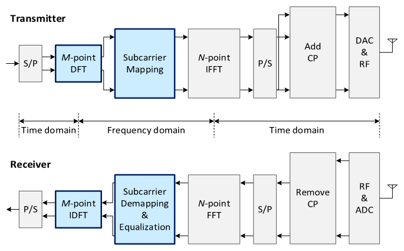
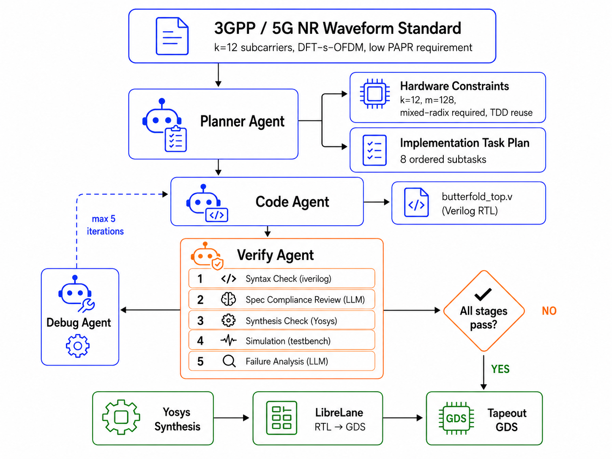

# 🦋 ButterFold

**A minimum-area 5G NR proof-of-concept DFT-s-OFDM + OFDM RX/TX core built around hyper-aggressive FFT butterfly reuse.**

> **One folded transform engine. Full RX/TX waveform path. Minimum area.**

ButterFold is a silicon-targeted baseband architecture that collapses the major transform blocks of an OFDM / DFT-s-OFDM modem onto a highly reused transform datapath. Because the minimum NR-style DFT-s-OFDM allocation uses **k = 12** subcarriers, the taped-out core reuses a **single mixed-radix butterfly engine**, not only a radix-2 butterfly. The m-point FFT/IFFT path uses radix-2 reuse, while the k=12 DFT/IDFT path is handled with a compact mixed-radix **3×4 decomposition**.

The taped-out version is intentionally tiny: it targets the **minimum useful 5G NR proof-of-concept configuration** first, while larger standards-shaped configurations can be explored in simulation.

---

---

## Why this chip exists

Modern OFDM and DFT-s-OFDM systems require multiple transforms across the RX/TX datapath:

- TX DFT for transform precoding
- TX IFFT for OFDM modulation
- RX FFT for OFDM demodulation
- RX IDFT for DFT-s-OFDM de-precoding

Most practical designs use parallelism to meet throughput. **ButterFold asks the opposite question: how small can the hardware become if we aggressively fold every transform onto one reusable mixed-radix engine?**

The goal is not to beat a commercial modem on throughput. The goal is to demonstrate a **silicon-realizable minimum-area modem core** that can support a narrow, standards-motivated 5G NR DFT-s-OFDM/OFDM proof of concept.

---

---

## What is DFT-s-OFDM?

DFT-s-OFDM stands for **Discrete Fourier Transform spread OFDM**. It is also commonly associated with **SC-FDMA**, the waveform family used heavily for LTE uplink and supported in 5G NR uplink.

At a high level, DFT-s-OFDM adds a DFT precoding step before OFDM modulation:

```text
Standard OFDM TX:

  QAM symbols
      │
      ▼
  subcarrier mapping
      │
      ▼
  IFFT
      │
      ▼
  CP insertion
      │
      ▼
  time-domain waveform


DFT-s-OFDM TX:

  QAM symbols
      │
      ▼
  k-point DFT
      │
      ▼
  subcarrier mapping
      │
      ▼
  m-point IFFT
      │
      ▼
  CP insertion
      │
      ▼
  time-domain waveform
```



The key idea is that the DFT spreads each data symbol across the allocated subcarriers before the OFDM IFFT. This gives the transmitted waveform a more single-carrier-like structure while retaining many OFDM benefits, such as frequency-domain equalization and flexible resource allocation.

### Why DFT-s-OFDM is useful

DFT-s-OFDM is important because it reduces **peak-to-average power ratio (PAPR)** compared with ordinary OFDM.

In regular OFDM, many subcarriers can add constructively in the time domain, creating large peaks. These peaks force the power amplifier to operate with significant backoff, which reduces efficiency.

```text
High PAPR problem:

  large waveform peaks
        ↓
  more PA backoff required
        ↓
  lower PA efficiency
        ↓
  higher power consumption
```

DFT-s-OFDM reduces this problem:

```text
DFT spreading
      ↓
more single-carrier-like waveform
      ↓
lower PAPR
      ↓
less PA backoff
      ↓
better transmit power efficiency
```

### Why this matters for tiny connected devices

Low PAPR is especially valuable for ultra-small connected devices, such as:

- smart sensors
- low-cost asset trackers
- packages
- drones
- industrial tags
- embedded wireless nodes
- dense 6G-style IoT devices

These devices are often constrained by:

- battery life
- RF front-end cost
- thermal budget
- PA efficiency
- silicon area
- package size

A low-PAPR uplink waveform can allow the transmitter power amplifier to operate more efficiently. That is one reason DFT-s-OFDM is attractive for small, low-power devices that need reliable connectivity without a large or expensive RF chain.

ButterFold targets this design point: a tiny, low-throughput, area-minimized digital baseband core that supports the transform structure needed for DFT-s-OFDM.

---

---

## Why ButterFold matters for 6G-style connectivity

A major 6G vision is connecting far more objects than today: packages, drones, industrial tags, low-cost sensors, embedded nodes, and smart infrastructure. Not every connected device needs high throughput. Many need:

- very low cost
- tiny silicon area
- low data rate
- simple waveform support
- low pin count
- lightweight baseband processing

ButterFold explores exactly that corner of the design space.

Instead of building a large high-throughput modem, ButterFold demonstrates how an OFDM / DFT-s-OFDM RX/TX core can be aggressively folded into a minimal transform engine. This type of architecture could help pave the way for **low-cost, low-throughput connectivity chips** for dense future networks.

---

---

## What subsystem are we building?

ButterFold is **not** a full modem and **not** an RFIC.

It is a small digital baseband transform subsystem that implements the core OFDM / DFT-s-OFDM transform path.

### In scope

ButterFold includes:

- k-point DFT for DFT-s-OFDM TX precoding
- subcarrier mapping into an m-point OFDM grid
- m-point IFFT for TX OFDM modulation
- CP insertion logic
- CP removal logic
- m-point FFT for RX OFDM demodulation
- subcarrier extraction
- k-point IDFT for DFT-s-OFDM RX de-precoding
- block-streaming digital I/O
- fixed-point transform datapath
- mixed-radix scheduling and verification

### Out of scope

ButterFold does **not** include:

- RF front end
- power amplifier
- LNA
- mixer
- PLL / frequency synthesizer
- ADC
- DAC
- channel estimation
- equalization beyond placeholder hooks
- coding / decoding
- HARQ
- MAC layer
- synchronization
- full 5G NR protocol stack
- full commercial modem scheduling

The project is intentionally scoped to the reusable digital transform core.

### Chip I/O at a high level

The taped-out core uses a narrow digital interface to keep pin count low.

```text
External digital input:

  din[7:0]
    8-bit signed interleaved I/Q stream

  din_valid
    marks valid input bytes

  mode
    selects TX or RX operation


External digital output:

  dout[7:0]
    8-bit signed interleaved I/Q stream

  dout_valid
    marks valid output bytes


Clocking / reset:

  clk_io
    external I/O clock

  clk_core
    optional faster internal compute clock

  rst_n
    active-low reset
```

The I/Q stream is interleaved:

```text
cycle 0: I0
cycle 1: Q0
cycle 2: I1
cycle 3: Q1
cycle 4: I2
cycle 5: Q2
...
```

### TX mode I/O behavior

```text
Input:
  k complex QAM symbols
  streamed as 2k 8-bit I/Q values

Processing:
  k-point DFT
  subcarrier mapping
  m-point IFFT
  CP insertion

Output:
  m complex time-domain OFDM samples
  plus CP if enabled
  streamed as interleaved 8-bit I/Q
```

### RX mode I/O behavior

```text
Input:
  m complex time-domain OFDM samples
  plus CP if enabled
  streamed as interleaved 8-bit I/Q

Processing:
  CP removal
  m-point FFT
  subcarrier extraction
  k-point IDFT

Output:
  k complex recovered symbols
  streamed as interleaved 8-bit I/Q
```

### Project boundary

ButterFold sits between a hypothetical modem controller and the mixed-signal/RF chain:

```text
        higher modem / testbench
                 │
                 ▼
        ┌──────────────────┐
        │   ButterFold     │
        │ digital OFDM /   │
        │ DFT-s-OFDM core  │
        └──────────────────┘
                 │
                 ▼
        DAC / ADC / RF front end
        not included in this project
```

So the project is best described as:

> a minimum-area reusable digital transform engine for the OFDM / DFT-s-OFDM portion of a modem, not a complete radio.

---

## DFT-s-OFDM / OFDM dataflow

```text
TX path: DFT-s-OFDM-style uplink

  QAM symbols
      │
      ▼
  k-point DFT
  k = 12
      │
      ▼
  subcarrier mapping
  place k bins into m grid
      │
      ▼
  m-point IFFT
  m = 128
      │
      ▼
  CP insertion
      │
      ▼
  time-domain waveform


RX path: OFDM / DFT-s-OFDM receive path

  time-domain waveform
      │
      ▼
  CP removal
      │
      ▼
  m-point FFT
  m = 128
      │
      ▼
  subcarrier extraction
  recover k active bins
      │
      ▼
  k-point IDFT
  k = 12
      │
      ▼
  QAM symbols
```

The tapeout configuration uses:

- **k = 12**  
  Minimum 1-RB DFT-s-OFDM allocation, since an NR resource block contains 12 subcarriers
- **m = 128**  
  Tiny proof-of-concept OFDM size for silicon demonstration
- **8-bit interleaved I/Q**
- **block-streaming operation**
- **folded mixed-radix transform execution**

---

---

## Architecture

```text
                         ButterFold Core
               minimum-area folded mixed-radix RX/TX engine

        8-bit interleaved I/Q in
                   │
                   ▼
        ┌──────────────────────┐
        │   Input Buffer / RAM │
        │   block streaming    │
        └──────────┬───────────┘
                   │
                   ▼
        ┌──────────────────────┐
        │   Address Generator  │
        │   stage / stride /   │
        │   permutation control│
        └──────────┬───────────┘
                   │
                   ▼
        ┌──────────────────────────────────────┐
        │      Reused Mixed-Radix Engine       │
        │                                      │
        │   radix-2 butterfly for m FFT/IFFT   │
        │   3×4 path for k=12 DFT/IDFT         │
        │   small radix-3 / 3-point kernel     │
        │   shared complex multiplier          │
        └──────────┬───────────────────────────┘
                   │
                   ▼
        ┌──────────────────────┐
        │   In-place RAM       │
        │   transform storage  │
        └──────────┬───────────┘
                   │
                   ▼
        ┌──────────────────────┐
        │   Output Buffer      │
        │   serialized output  │
        └──────────┬───────────┘
                   │
                   ▼
        8-bit interleaved I/Q out


        ┌──────────────────────┐
        │ FSM Scheduler        │
        │ TX/RX mode control   │
        │ transform sequencing │
        └──────────────────────┘

        ┌──────────────────────┐
        │ Twiddle ROM / CORDIC │
        │ design-space option  │
        └──────────────────────┘
```

ButterFold uses:

- **one reused mixed-radix transform engine**
- **radix-2 butterfly reuse for the m-point FFT/IFFT**
- **3×4 mixed-radix decomposition for k=12 DFT/IDFT**
- **small 3-point kernel for the radix-3 portion**
- **one shared complex multiplier**
- **in-place transform RAM**
- **twiddle ROM or generated twiddle option**
- **FSM-based scheduling**
- **8-bit interleaved I/Q block-streaming I/O**

---

---

## Key idea

```text
Traditional modem:
  many butterflies
  parallel FFTs
  high throughput
  larger area

ButterFold:
  one mixed-radix transform engine
  reused in time
  lower throughput
  minimum area
```

ButterFold intentionally trades throughput for silicon area. A faster internal compute clock and deterministic scheduling can recover some throughput while preserving the extremely folded architecture.

---

---

## Spec-compliance strategy

ButterFold is designed around **minimum possible 5G NR proof-of-concept compliance**, not full commercial modem compliance.

The tapeout core intentionally supports a narrow fixed configuration:

| Feature | Tapeout choice | Purpose |
|---|---|---|
| DFT size | `k = 12` | Minimum 1-RB transform-precoded allocation |
| OFDM size | `m = 128` | Smallest practical silicon demo target |
| Waveform path | DFT-s-OFDM TX + OFDM RX/TX transform chain | Demonstrates NR-style baseband structure |
| Interface | 8-bit interleaved I/Q | Reduces pins for tapeout |
| Scheduling | Block streaming | Deterministic verification and low area |

This means the taped-out chip is **standards-motivated and NR-inspired**, but not a full-bandwidth, fully schedulable 5G NR modem. A larger simulation model will extend the same folded architecture toward more complete NR parameterizations, including realistic `k = 12 × N_RB`, larger FFT sizes, and timing checks.

---

---

## Minimum-compliant TDD system target

ButterFold specifically targets a **minimum-compliant TDD-style system** because TDD enables the same physical transform hardware to be reused across both receive and transmit operation.

This gives ButterFold two layers of reuse:

```text
Reuse dimension 1: RX/TX reuse

  TX path:
    k-point DFT  →  m-point IFFT

  RX path:
    m-point FFT  →  k-point IDFT

  Same hardware is reused because the system is half-duplex TDD.


Reuse dimension 2: transform-size reuse

  k-point transforms:
    DFT / IDFT for DFT-s-OFDM precoding and de-precoding

  m-point transforms:
    FFT / IFFT for OFDM demodulation and modulation

  Same folded mixed-radix engine is reused across both sizes.
```

The tapeout core therefore does not only reuse hardware between FFT and IFFT. It also reuses the same compute path across:

- **TX and RX**
- **DFT and IDFT**
- **FFT and IFFT**
- **k-point and m-point transforms**

This is why TDD is central to the architecture. In a half-duplex TDD system, RX and TX do not need to run at the exact same time, which allows one folded transform engine to serve the entire modem datapath.

```text
Half-duplex TDD timing model:

  RX window:
    CP removal → m-point FFT → k-bin extraction → k-point IDFT

  Guard / turnaround:
    RF and baseband mode switch

  TX window:
    k-point DFT → subcarrier mapping → m-point IFFT → CP insertion
```

This is the minimum system assumption that makes the aggressive reuse strategy practical.

---

---

## Design-space exploration

ButterFold is not just one fixed RTL implementation. The project also explores the hardware design space around **how much transform flexibility can be achieved before area, power, or verification complexity becomes too high**.

### Mixed-radix butterfly options to explore

The minimum tapeout target needs exact support for **k = 12 = 3 × 4**, but the larger simulation core can evaluate several reusable transform engines:

| Candidate | Why explore it |
|---|---|
| **Radix-2 only** | Smallest datapath; cleanest m-point FFT/IFFT; cannot directly handle k=12 |
| **Radix-2 + 3-point kernel** | Best fit for k=12 while preserving a mostly radix-2 architecture |
| **Radix-2/4 mixed radix** | Reduces m-point FFT/IFFT cycles when m is 128 or 256 |
| **Radix-3/4 mixed radix** | Natural decomposition for k=12 using 3×4 structure |
| **Radix-2/3/5 mixed radix** | More LTE/NR-like scalability for larger `k = 12 × N_RB` values such as 60, 120, 300 |
| **Good-Thomas 3×4 decomposition** | Avoids some twiddle multiplications for k=12 using fixed permutations |
| **Direct small-DFT kernel** | Potentially smallest for fixed k=12, but less reusable |
| **CORDIC / generated twiddles** | Reduces ROM storage at the cost of extra cycles and datapath logic |

### Main tradeoffs

The design-space study will search for a middle ground across:

| Tradeoff | Question |
|---|---|
| **Twiddle ROM size vs butterfly size** | Should twiddles be stored, generated, shared, or absorbed into fixed kernels? |
| **Throughput vs area** | How many cycles can be tolerated before extra butterflies become worthwhile? |
| **Clock speed vs power** | Does a fast internal clock preserve area savings, or does dynamic power dominate? |
| **Compliance vs minimum proof of concept** | What is the smallest fixed configuration that still demonstrates an NR-style DFT-s-OFDM/OFDM chain? |
| **Radix flexibility vs verification complexity** | How many transform sizes can be supported before the scheduler becomes too risky for tapeout? |
| **Memory size vs control complexity** | Is it better to store more intermediate data or compute/permutate more aggressively? |
| **Quantization vs area** | How far can 8-bit I/Q and compact twiddles go before EVM becomes unacceptable? |

### Expected outcome

The tapeout chip will freeze one minimal configuration for reliability, while simulation will compare broader architecture points:

```text
Tiny tapeout:
  fixed k=12, m=128
  one folded mixed-radix engine
  low pin count
  easy verification

Simulation sweep:
  larger m
  larger k = 12 × N_RB
  multiple radix strategies
  area / cycles / power / compliance comparison
```

---

---

## Why ButterFold is a good tapeout candidate

ButterFold is a strong tapeout target because it has a clean, bounded, silicon-friendly scope:

| Property | Why it helps tapeout |
|---|---|
| Fixed `k` and `m` | Small state space and simpler verification |
| Single reused mixed-radix datapath | Minimal area and clear architectural novelty |
| 8-bit interleaved I/Q | Low pin count |
| Block streaming | Deterministic testbench timing |
| Small transform sizes | Practical for first silicon |
| Larger model left to simulation | Avoids bloating the taped-out chip |

This makes the chip realistic to verify before submission while still demonstrating a meaningful hardware architecture.

---

---

## IEEE SCSS PICO Chipathon Track D fit

ButterFold is being built for the **IEEE SCSS "PICO" Open-Source Chipathon Track D — AI / LLM-assisted Circuits**.

This track focuses on AI/LLM-assisted workflows for developing tapeout-ready analog and digital circuits, including:

- agentic design flows
- generator-based methodologies
- design-space exploration
- reproducible design approaches
- RTL generation
- circuit implementation
- physical design
- verification
- closure
- silicon-ready results

ButterFold is a strong fit because the project is not just a modem core. It is also a testbed for an **AI-assisted IC design methodology**.

The project has a clear path from:

```text
wireless standard constraints
        ↓
architecture exploration
        ↓
mixed-radix transform planning
        ↓
RTL generation
        ↓
golden-model generation
        ↓
verification
        ↓
area / power / timing analysis
        ↓
tapeout-ready implementation
```

This makes it a natural candidate for Track D because the design requires repeated architectural tradeoff analysis, standards-aware reasoning, RTL iteration, verification planning, and physical-design feedback.

---

---

## AI / LLM-assisted design workflow

ButterFold uses agentic AI as a **spec-to-silicon design assistant** — translating large modem specifications into traceable hardware constraints, bounded RTL implementations, golden models, and scalable design-space studies.

The AI contribution is not autonomous RTL generation alone, but **standards-aware design closure**: preserving a traceable chain from 3GPP-style waveform requirements, to architectural parameter choices, to RTL and golden-model generation, to verification and design-space exploration.

This distinguishes ButterFold from generic agentic RTL workflows in four concrete ways:

| Generic agentic RTL workflow | ButterFold's stronger angle |
|---|---|
| Agents write Verilog | Agents translate communication specs into hardware constraints |
| Agents check each other's RTL | Agents check RTL against spec-derived waveform behavior |
| DSE over arbitrary architectures | DSE over standards-motivated modem parameterizations |
| One-off chip generation | Reusable methodology for other modem / wireless chips |

### 1. Standards-to-constraints translation

The first agent step is not code generation — it is constraint extraction. The planner agent reads the modem specification and produces a hardware constraint document before any Verilog is written:

- why `k = 12` requires a mixed-radix engine (not just radix-2)
- why TDD is the assumption that makes RX/TX hardware reuse legal
- what the minimum NR-style DFT-s-OFDM configuration actually is
- which parameters are frozen for tapeout vs left open for DSE
- what compliance means for a proof-of-concept vs a full NR modem

Output artifacts:

- hardware constraint document (parameter bounds, transform sizes, reuse assumptions)
- fixed tapeout configuration
- compliance boundary definition
- design-space axes for the simulation sweep

### 2. Bounded RTL generation

With constraints locked, the code agent generates Verilog that stays inside those bounds. The workflow prevents uncontrolled feature growth by grounding every subtask in the frozen tapeout spec.

Components generated:

- mixed-radix transform scheduler
- radix-2 butterfly datapath
- 3-point kernel for k=12
- twiddle ROM generation scripts
- address-generation logic
- block-streaming interface
- TDD RX/TX mode controller
- fixed-point scaling logic

### 3. Spec-derived waveform verification

The verify agent does not only check Verilog syntax. It checks RTL behavior against waveform-level expectations derived directly from the spec:

- zero input → zero output (linearity required by DFT linearity)
- impulse input → flat spectrum output (DFT property)
- TX→RX loopback → recovered symbols match originals
- `busy`, `done`, `dout_valid` timing matches block-streaming contract

These are not arbitrary unit tests — they are consequences of the 3GPP-style waveform structure the spec describes.

### 4. Standards-motivated design-space exploration

Verification tasks include:

- generating a bit-accurate golden model
- generating directed test vectors
- comparing RTL output against the golden model
- testing impulse, tone, random QAM, all-zero, max/min, and overflow cases
- checking input/output ordering
- validating block-streaming timing
- validating TDD RX/TX mode reuse
- validating k-point and m-point transform reuse
- generating compliance-oriented assertions

The key verification rule is:

```text
RTL must match the bit-accurate tapeout golden model.
The larger standards-shaped simulator is separate.
```

This keeps tapeout verification bounded and reproducible.

### 4. Design-space exploration

Agentic workflows are especially valuable for ButterFold because the design space is large.

LLMs can help generate and compare design variants across:

- radix-2 only
- radix-2 plus 3-point kernel
- radix-2/4 mixed radix
- radix-3/4 mixed radix
- radix-2/3/5 mixed radix
- Good-Thomas 3×4 decomposition
- direct small-DFT kernels
- ROM-based twiddles
- generated twiddles
- CORDIC-style twiddles
- different fixed-point widths
- different internal clock ratios
- different buffer sizes
- different `k` and `m` support points

Each candidate can be evaluated for:

- area
- power
- maximum clock frequency
- cycle count
- latency
- throughput degradation
- ROM size
- verification complexity
- compliance coverage

### 5. Physical-design and closure assistance

The AI-assisted workflow can also support later implementation steps:

- generate synthesis constraint drafts
- inspect timing reports
- identify critical paths
- suggest retiming or pipelining options
- summarize area reports
- compare synthesis results across variants
- help generate reproducible build scripts
- document implementation decisions

The goal is a reproducible, open-source workflow that shows how LLMs can assist practical IC design without replacing engineering judgment.

---

---
## Agentic Verilog Design Workflow



This project follows a multi-agent LLM workflow inspired by VerilogCoder, where different LLM agents cooperate to convert a natural-language hardware specification into verified Verilog RTL. Instead of relying on a single model to directly generate the full design, the workflow separates planning, code generation, verification, and debugging into specialized agent roles.

The input to the system is a module-level natural-language problem description. A **Task Planning Agent** first breaks the specification into smaller hardware subtasks, such as identifying module inputs/outputs, extracting circuit signals, understanding state transitions, and building a task-driven circuit relation graph. This planning stage helps the system reason about the design structure before producing RTL.

After the task plan is generated, a **Verilog Code Agent** implements each subtask step by step. For example, it may first define the module interface, then implement combinational logic, then sequential state-transition logic, and finally integrate the complete module. This makes the RTL generation process more controlled and easier to debug.

A separate **Verification and Debug Agent** checks the generated Verilog using syntax checking, simulation, waveform tracing, and testbench-based validation. If errors are found, the debug agent sends feedback to the code agent, which revises the RTL until the design becomes functionally correct.

For our chip-design workflow, this approach is useful because it creates a structured loop:

```text
Natural-language hardware spec
        ↓
Task planning and circuit-relation extraction
        ↓
Subtask-wise Verilog generation
        ↓
Syntax checking and simulation
        ↓
Waveform/debug feedback
        ↓
Corrected Verilog RTL
```

---

---

## Running the Agentic Workflow

This is the step-by-step guide to running the four-agent pipeline on the ButterFold spec inside the IIC-OSIC-TOOLS Docker environment.

### Prerequisites

| Requirement | Where to get it |
|---|---|
| IIC-OSIC-TOOLS Docker container running | VNC at `http://localhost:80` |
| Terminal inside Docker | Open terminal from the VNC desktop |
| Anthropic API key | `https://console.anthropic.com` |
| Python 3.10+ | Already in the Docker container |
| `iverilog` / `vvp` | Already in the Docker container |
| `yosys` | Already in the Docker container |

### Writing your own module spec

The agents read `modular_description.md` as their hardware specification.
A filled-in template is provided to make this easy:

```bash
cp modular_description.template.md modular_description.md
# open modular_description.md and fill in every section
```

The template covers: module name, ports, operating modes, processing steps,
key parameters, architecture constraints, timing model, exclusions, and
verification hints. The more precise you are, the fewer debug iterations
the agents need.

---

### Step 0 — One-time setup (run inside Docker terminal)

**0a. Place the project in the Docker-accessible designs folder**

The Docker container mounts `C:\Users\ashar\eda\designs` (your Windows host) as `/foss/designs` inside the container. Clone or copy the `butterfold` folder there:

```bash
cd /foss/designs
git clone <your-butterfold-repo-url> butterfold
cd butterfold
```

**0b. Install Python dependencies**

```bash
pip install -r requirements.txt
```

**0c. Set your Anthropic API key**

Open `.env` and replace the placeholder:

```
ANTHROPIC_API_KEY=sk-ant-api03-your-key-here
```

---

### Option A — Run everything automatically (recommended)

`agents/orchestrator.py` uses LangGraph to wire all four agents into a single automated pipeline with a built-in debug loop and a final summary:

```bash
python agents/orchestrator.py
```

The graph runs: **planner → code\_agent → verify → (debug loop if needed) → summarize**

- Loops the verify → debug cycle up to 5 times automatically
- Prints a bullet-point summary to the terminal when done
- Saves `generated/summary.md` with the run report

### Option B — Run agents individually (for debugging)

All commands run from the `butterfold/` directory inside the Docker terminal.

```
python agents/planner.py          # Step 1 — create task plan
python agents/code_agent.py       # Step 2 — generate RTL
python agents/verify.agent.py     # Step 3 — syntax check + simulate
python agents/debug_agent.py      # Step 4 — fix errors (only if Step 3 failed)
```

Repeat Steps 3 and 4 until `verify_result.json` shows `"syntax_ok": true`.

---

### What each agent does

#### Step 1 — Planner (`agents/planner.py`)

**Reads:** `modular_description.md`  
**Writes:** `generated/plan.json`

Sends the full `butterfold_top` module specification to Claude and receives a structured JSON task plan. The plan breaks the design into ordered subtasks — module interface, address generator, radix-2 butterfly, 3×4 mixed-radix kernel, FSM scheduler, subcarrier mapper, CP logic, and I/O integration.

```bash
python agents/planner.py
```

Expected output:
```
[planner] Plan written to generated/plan.json
[planner] 8 subtasks generated
```

---

#### Step 2 — Code Agent (`agents/code_agent.py`)

**Reads:** `generated/plan.json` + `modular_description.md`  
**Writes:** `generated/rtl/<subtask_id>.v` for each subtask, then `generated/rtl/butterfold_top.v` (combined)

Iterates through each subtask in the plan. For each one, it sends the spec, the full plan, and all previously generated RTL as context, then asks Claude to generate synthesizable Verilog for that specific subtask. Accumulates the subtasks into a single `butterfold_top.v`.

```bash
python agents/code_agent.py
```

Expected output:
```
[code_agent] Generating subtask: module_interface
[code_agent]  -> generated/rtl/module_interface.v
[code_agent] Generating subtask: radix2_butterfly
[code_agent]  -> generated/rtl/radix2_butterfly.v
...
[code_agent] Combined RTL written to generated/rtl/butterfold_top.v
```

---

#### Step 3 — Verify Agent (`agents/verify.agent.py`)

**Reads:** `generated/rtl/butterfold_top.v`  
**Writes:** `generated/verify_result.json`, `generated/logs/syntax.log`, `generated/logs/sim.log`

Runs `iverilog -g2012 -Wall -t null` for a syntax-only check. If a testbench exists at `generated/rtl/tb_butterfold_top.v`, also compiles and runs simulation with `vvp`. Writes a JSON result file that the debug agent reads.

```bash
python agents/verify.agent.py
```

Passing output:
```
[verify] Syntax OK
[verify] Simulation PASSED
```

Failing output:
```
[verify] Syntax FAILED:
generated/rtl/butterfold_top.v:42: error: ...
```

---

#### Step 4 — Debug Agent (`agents/debug_agent.py`)

**Reads:** `generated/verify_result.json` + `generated/rtl/butterfold_top.v`  
**Writes:** updated `generated/rtl/butterfold_top.v` (overwritten in place)

Reads the error log, sends the failing RTL + errors + original spec to Claude, and applies the returned fix. Re-runs the verify agent after each patch. Loops up to 5 times automatically.

```bash
python agents/debug_agent.py
```

Expected output:
```
[debug] Iteration 1 — sending errors to LLM
[debug] RTL updated — re-running verification
[debug] Fixed after 1 iteration(s).
```

---

### Post-verification: EDA tool steps inside Docker

Once `verify_result.json` shows `"syntax_ok": true`, proceed with the EDA tools.

#### Synthesis with Yosys

```bash
cd /foss/designs/butterfold
yosys << 'EOF'
read_verilog generated/rtl/butterfold_top.v
synth -top butterfold_top
stat
write_verilog generated/synth/butterfold_top_synth.v
EOF
```

This gives you gate count, estimated area, and a gate-level netlist.

#### Waveform inspection with GTKWave

If the verify agent produced a `.vcd` file during simulation:

```bash
gtkwave generated/logs/sim.vcd &
```

#### RTL-to-GDS with LibreLane

Follow the chipathon-provided tutorial:

```bash
# See: sscs-chipathon-2026/examples/librelane_rtl2gds_gf180
# Copy the config template, point it at generated/rtl/butterfold_top.v,
# then run the LibreLane flow to get a GDS.
```

---

### Directory layout after running

```
butterfold/
├── .env                              ← your API key (never commit)
├── requirements.txt
├── modular_description.md            ← hardware spec (the agent input)
├── agents/
│   ├── planner.py                    ← Step 1
│   ├── code_agent.py                 ← Step 2
│   ├── verify.agent.py               ← Step 3
│   └── debug_agent.py                ← Step 4
└── generated/                        ← all agent outputs (gitignored logs)
    ├── plan.json                     ← planner output
    ├── verify_result.json            ← verify agent output
    ├── rtl/
    │   ├── butterfold_top.v          ← combined synthesizable RTL
    │   ├── tb_butterfold_top.v       ← testbench (if generated)
    │   └── <subtask_id>.v            ← per-subtask modules
    └── logs/
        ├── syntax.log
        └── sim.log
```

---

### Troubleshooting

| Problem | Fix |
|---|---|
| `ANTHROPIC_API_KEY` not set | Edit `.env` and set your key from `console.anthropic.com` |
| `iverilog: command not found` | You are outside Docker — open VNC at `http://localhost:80` and run from the Docker terminal |
| `ModuleNotFoundError: anthropic` | Run `pip install -r requirements.txt` inside Docker |
| `generated/plan.json not found` | Run `python agents/planner.py` first |
| Debug loops 5 times without fixing | Review `generated/rtl/butterfold_top.v` and `generated/logs/` manually, adjust `modular_description.md` if the spec is ambiguous, then re-run from Step 1 |
| VCD file too large for GTKWave | Limit waveform dump to the specific signals you need in the testbench |

---

---

## Why this is a strong Chipathon project

ButterFold is a strong project for the PICO Track D because it combines:

- a real communications architecture problem
- an aggressive digital hardware reuse strategy
- standards-aware planning
- mixed-radix DSP implementation
- RTL and golden-model verification
- design-space exploration
- tapeout-oriented constraints
- AI-assisted workflow documentation

The project is small enough to be tapeout-realistic but deep enough to demonstrate meaningful AI-assisted circuit design.

### What makes it original

Most OFDM hardware work focuses on making FFT engines faster, more parallel, more flexible, or more throughput-efficient. ButterFold intentionally pushes in the opposite direction:

> How far can we collapse an OFDM / DFT-s-OFDM RX/TX chain into one reused mixed-radix transform engine?

The project’s novelty is the **degree of reuse**:

```text
same engine for RX and TX
same engine for FFT and IFFT
same engine for DFT and IDFT
same engine for k-point and m-point transforms
same architecture studied across proof-of-concept and standards-shaped modes
```

This level of reuse is intentionally extreme, which makes it a strong opportunity for an original publication. Even if the architecture sacrifices throughput, the power/area/throughput/compliance tradeoff is itself publishable.

### What the paper can analyze

A paper based on ButterFold can include:

- area savings from folded transform reuse
- power impact of higher internal clocking
- throughput degradation from serialization
- cycle-count models for different `k` and `m`
- mixed-radix implementation tradeoffs
- twiddle ROM vs generated-twiddle tradeoffs
- fixed-point EVM impact
- minimum proof-of-concept compliance analysis
- comparison between tiny tapeout and larger standards-shaped simulation
- AI/LLM-assisted workflow impact on design iteration speed

This gives the project both a hardware contribution and a methodology contribution.

---

---

## Research claim

ButterFold makes two claims — one hardware, one methodology.

**Hardware claim:**

> A minimum-area, standards-motivated OFDM / DFT-s-OFDM RX/TX core can be constructed by folding DFT, IDFT, FFT, and IFFT operations onto a single mixed-radix transform engine, trading throughput for extreme area efficiency while preserving a path toward broader NR-style configurations.

**Methodology claim:**

> Standards-aware design closure — preserving a traceable chain from 3GPP-style waveform requirements to architectural constraints to RTL to verified silicon — can be partially automated using a multi-agent LLM workflow, reducing the manual effort required to explore the hardware design space of modem building blocks.

The hardware claim is measurable through:

- gate count, RAM size, twiddle storage
- cycle count, maximum clock frequency, power
- EVM, latency, compliance coverage

The methodology claim is measurable through:

- number of debug iterations to correct RTL
- spec-constraint traceability (can every RTL parameter be traced back to a waveform requirement?)
- design-space coverage (how many architecture variants were evaluated vs a manual flow?)
- time-to-verified-RTL compared to a baseline manual implementation

Both claims together make the project technically grounded, tapeout-relevant, and publication-oriented.


---

---

## Project strategy

ButterFold uses a two-track approach:

### 1. Tapeout core
A tiny, frozen, verification-first silicon design:

- fixed **k = 12**
- fixed **m = 128**
- mixed-radix k-path for exact 12-point DFT/IDFT
- radix-2 reused m-path for FFT/IFFT
- low-pin 8-bit I/Q interface
- bit-accurate golden model
- RTL verified against the golden model

### 2. Larger simulation core
A scalable model for standards-shaped exploration:

- larger FFT sizes
- realistic `k = 12 × N_RB`
- NR-like mapping and timing
- 4G / 5G NR / 6G-inspired design-space analysis
- area / latency / throughput tradeoff analysis

This keeps the taped-out chip focused and achievable while still enabling a stronger standards and future-connectivity research story.

---

---

## Potential publication targets

ButterFold can be framed for either circuits, design automation, or communications-oriented venues depending on which results are strongest.

### Circuits / VLSI / implementation-focused

- **IEEE ISCAS** — strong fit for DSP architecture, low-area signal processing, and AI-assisted design methodology
- **IEEE ICECS** — good fit for circuit/system implementation and open-source design flows
- **IEEE VLSI-SoC** — suitable if the silicon implementation and area/power analysis are strong
- **IEEE SOCC** — possible fit for SoC-oriented implementation and design methodology
- **IEEE MWSCAS** — good fit for compact DSP/VLSI architecture work

### Design automation / AI-assisted IC design

- **IEEE/ACM ICCAD** — ambitious target if the AI-assisted workflow and design-space exploration are the main contribution
- **ACM/IEEE DAC** — ambitious target if the project emphasizes agentic design methodology and reproducible chip implementation
- **IEEE/ACM ASP-DAC** — possible fit for AI-assisted design-space exploration and implementation flow
- **MLCAD** — strong fit if the paper emphasizes LLM/agentic assistance for RTL generation, verification, and closure

### Communications / signal-processing implementation

- **IEEE SPAWC** — possible fit if the focus is low-complexity waveform implementation
- **IEEE WCNC** — possible fit for NR/6G low-cost connectivity framing
- **IEEE GLOBECOM Workshops** — good fit for 6G low-cost connectivity, open-source wireless hardware, or AI-assisted PHY implementation
- **IEEE ICC Workshops** — good fit for early-stage 6G and implementation-oriented PHY work

### Open-source silicon / education / reproducibility

- **WOSET** — very strong fit for open-source EDA, reproducible silicon, and open tapeout methodology
- **Tiny Tapeout / open-source silicon workshop venues** — strong fit for the tapeout and educational hardware angle

The strongest initial target is likely a workshop or implementation-oriented venue, with the longer-term goal of a stronger conference submission once tapeout, synthesis, and simulation results are complete.

---

---

## One-line summary

**ButterFold uses agentic AI as a spec-to-silicon design assistant, translating large modem specifications into traceable hardware constraints, bounded RTL implementations, golden models, and scalable design-space studies — demonstrated on a minimum-area OFDM / DFT-s-OFDM RX/TX core.**


---
