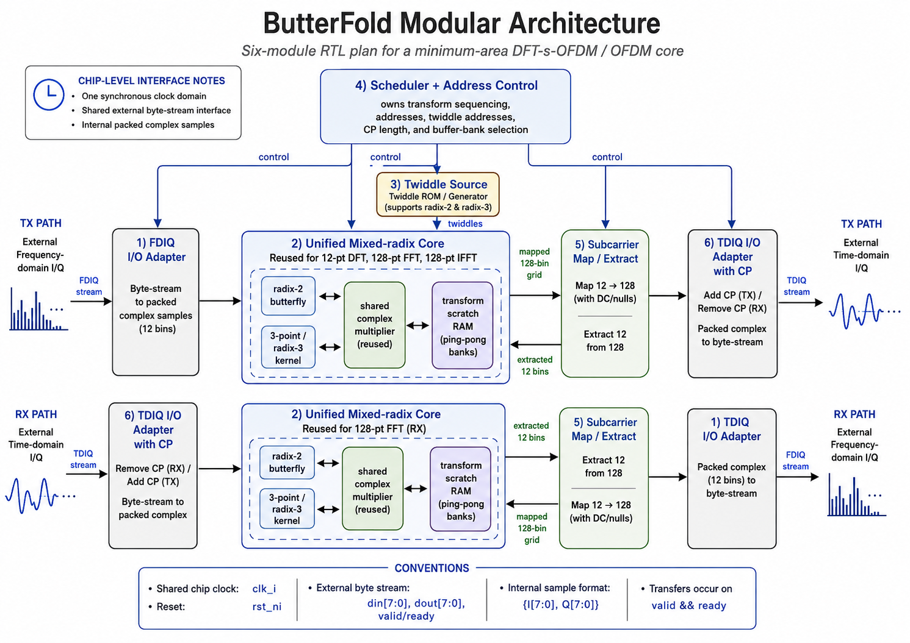
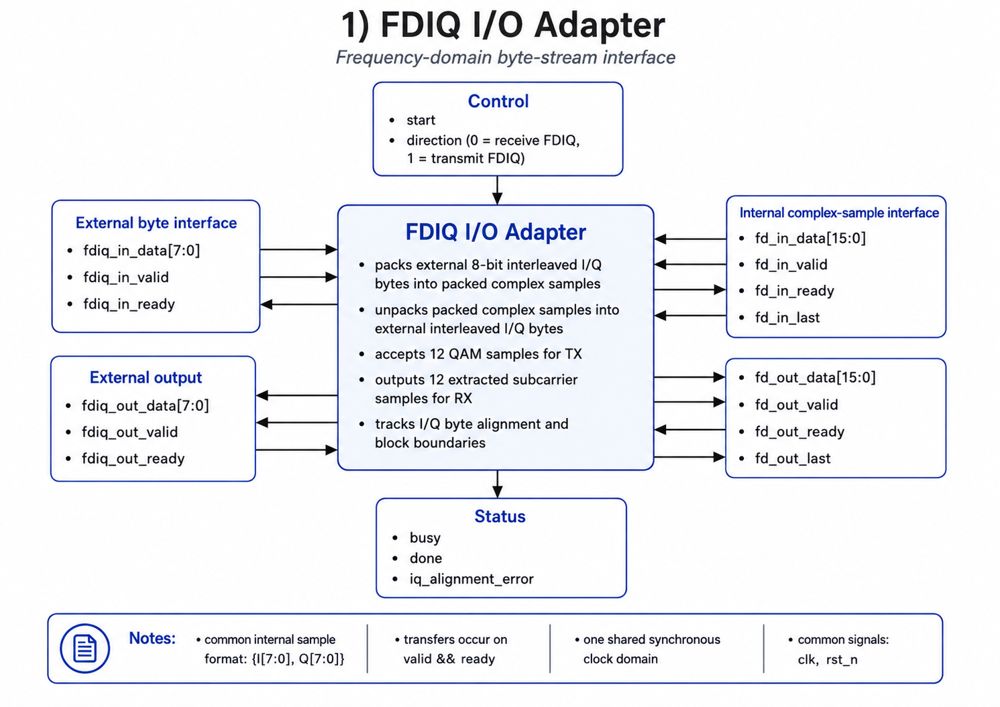
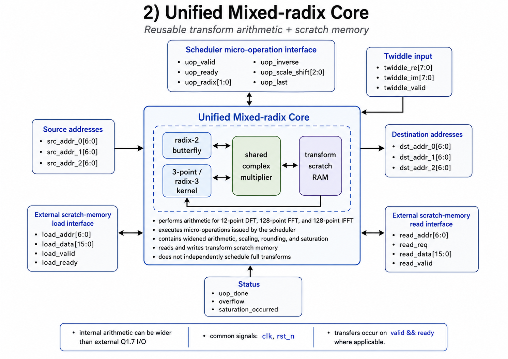
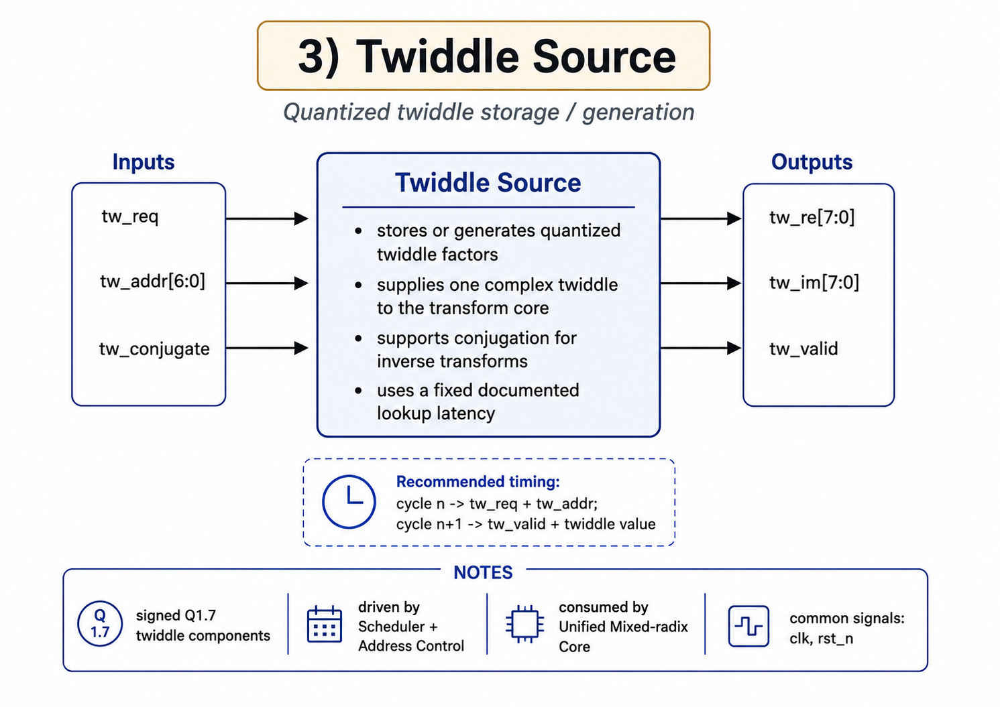
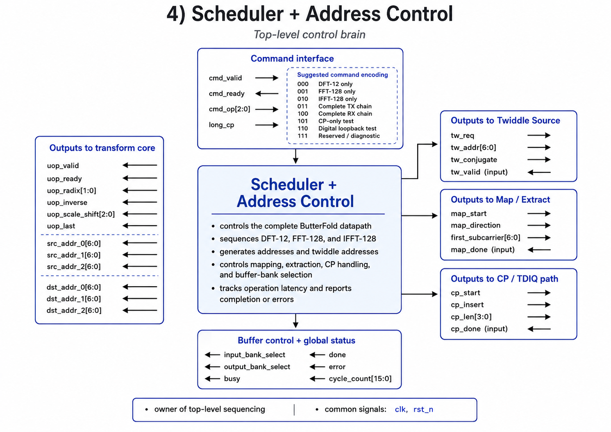
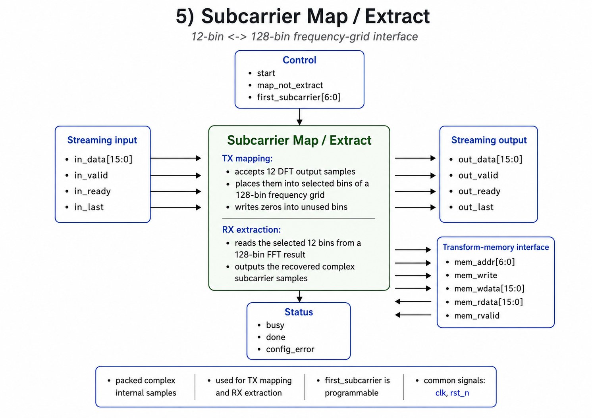
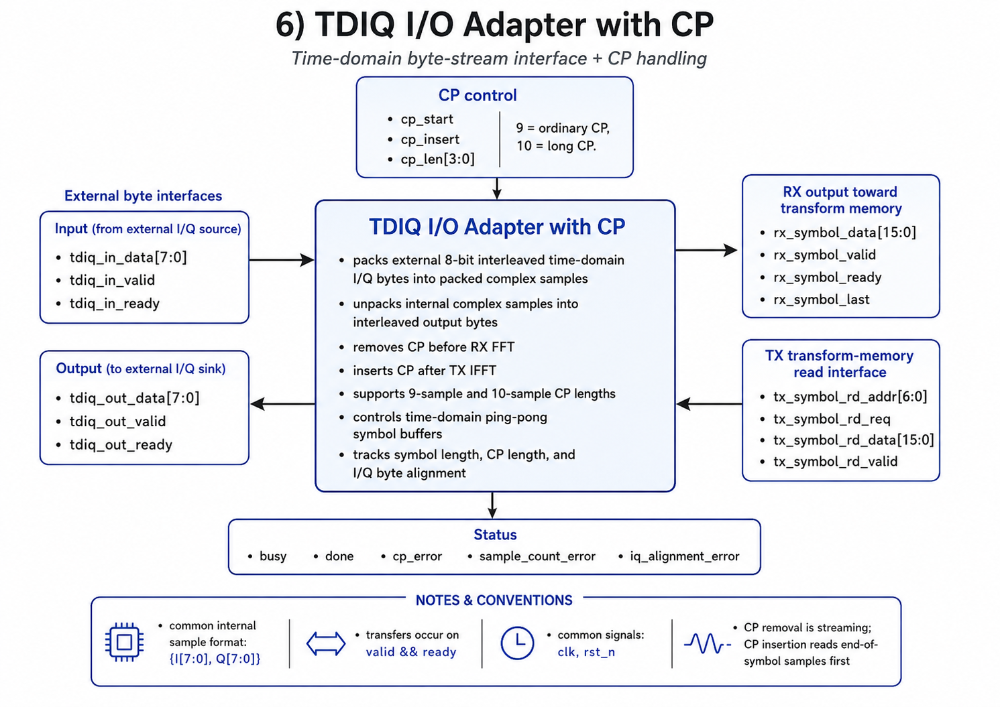

# 🦋 ButterFold

**A minimum-area 5G NR proof-of-concept DFT-s-OFDM + OFDM RX/TX core built around hyper-aggressive FFT butterfly reuse.**

> **One folded transform engine. Full RX/TX waveform path. Minimum area.**

ButterFold is a silicon-targeted baseband architecture that collapses the major transform blocks of an OFDM / DFT-s-OFDM modem onto a highly reused transform datapath. Because the minimum NR-style DFT-s-OFDM allocation uses **k = 12** subcarriers, the taped-out core reuses a **single mixed-radix butterfly engine**, not only a radix-2 butterfly. The m-point FFT/IFFT path uses radix-2 reuse, while the k=12 TX DFT path is handled with a compact mixed-radix **3×4 decomposition**.

The taped-out version is intentionally tiny: it targets the **minimum useful 5G NR proof-of-concept configuration** first, while larger standards-shaped configurations can be explored in simulation.

---

---

## Why this chip exists

Modern OFDM and DFT-s-OFDM systems require multiple transforms across the RX/TX datapath:

- TX DFT for transform precoding
- TX IFFT for OFDM modulation
- RX FFT for OFDM demodulation

For the uplink DFT-s-OFDM plus downlink CP-OFDM case used here, ButterFold folds these **3 separate transforms** into one reused engine.

Most practical designs use parallelism to meet throughput. **ButterFold asks the opposite question: how small can the hardware become if we aggressively fold every transform onto one reusable mixed-radix engine?**

The goal is not to beat a commercial modem on throughput. The goal is to demonstrate a **silicon-realizable minimum-area modem core** that can support a narrow, standards-motivated 5G NR DFT-s-OFDM/OFDM proof of concept.

---

---

## What is DFT-s-OFDM?

DFT-s-OFDM stands for **Discrete Fourier Transform spread OFDM**. It is also commonly associated with **SC-FDMA**, the waveform family used heavily for LTE uplink and supported in 5G NR uplink.

At a high level, DFT-s-OFDM adds a DFT precoding step before OFDM modulation:

```text
Standard OFDM TX:

  QAM symbols
      │
      ▼
  subcarrier mapping
      │
      ▼
  IFFT
      │
      ▼
  CP insertion
      │
      ▼
  time-domain waveform


DFT-s-OFDM TX:

  QAM symbols
      │
      ▼
  k-point DFT
      │
      ▼
  subcarrier mapping
      │
      ▼
  m-point IFFT
      │
      ▼
  CP insertion
      │
      ▼
  time-domain waveform
```


The key idea is that the DFT spreads each data symbol across the allocated subcarriers before the OFDM IFFT. This gives the transmitted waveform a more single-carrier-like structure while retaining many OFDM benefits, such as frequency-domain equalization and flexible resource allocation.

### Why DFT-s-OFDM is useful

DFT-s-OFDM is important because it reduces **peak-to-average power ratio (PAPR)** compared with ordinary OFDM.

In regular OFDM, many subcarriers can add constructively in the time domain, creating large peaks. These peaks force the power amplifier to operate with significant backoff, which reduces efficiency.

```text
High PAPR problem:

  large waveform peaks
        ↓
  more PA backoff required
        ↓
  lower PA efficiency
        ↓
  higher power consumption
```

DFT-s-OFDM reduces this problem:

```text
DFT spreading
      ↓
more single-carrier-like waveform
      ↓
lower PAPR
      ↓
less PA backoff
      ↓
better transmit power efficiency
```

### Why this matters for tiny connected devices

Low PAPR is especially valuable for ultra-small connected devices, such as:

- smart sensors
- low-cost asset trackers
- packages
- drones
- industrial tags
- embedded wireless nodes
- dense 6G-style IoT devices

These devices are often constrained by:

- battery life
- RF front-end cost
- thermal budget
- PA efficiency
- silicon area
- package size

A low-PAPR uplink waveform can allow the transmitter power amplifier to operate more efficiently. That is one reason DFT-s-OFDM is attractive for small, low-power devices that need reliable connectivity without a large or expensive RF chain.

ButterFold targets this design point: a tiny, low-throughput, area-minimized digital baseband core that supports the transform structure needed for DFT-s-OFDM.

---

---

## Why ButterFold matters for 6G-style connectivity

A major 6G vision is connecting far more objects than today: packages, drones, industrial tags, low-cost sensors, embedded nodes, and smart infrastructure. Not every connected device needs high throughput. Many need:

- very low cost
- tiny silicon area
- low data rate
- simple waveform support
- low pin count
- lightweight baseband processing

ButterFold explores exactly that corner of the design space.

Instead of building a large high-throughput modem, ButterFold demonstrates how an OFDM / DFT-s-OFDM RX/TX core can be aggressively folded into a minimal transform engine. This type of architecture could help pave the way for **low-cost, low-throughput connectivity chips** for dense future networks.

---

---

## What subsystem are we building?

ButterFold is **not** a full modem and **not** an RFIC.

It is a small digital baseband transform subsystem that implements the core OFDM / DFT-s-OFDM transform path.

### In scope

ButterFold includes:

- k-point DFT for DFT-s-OFDM TX precoding
- subcarrier mapping into an m-point OFDM grid
- m-point IFFT for TX OFDM modulation
- CP insertion logic
- CP removal logic
- m-point FFT for RX OFDM demodulation
- subcarrier extraction
- block-streaming digital I/O
- fixed-point transform datapath
- mixed-radix scheduling and verification

### Out of scope

ButterFold does **not** include:

- RF front end
- power amplifier
- LNA
- mixer
- PLL / frequency synthesizer
- ADC
- DAC
- channel estimation
- equalization beyond placeholder hooks
- coding / decoding
- HARQ
- MAC layer
- synchronization
- full 5G NR protocol stack
- full commercial modem scheduling

The project is intentionally scoped to the reusable digital transform core.

### Top-level chip I/O

The taped-out core uses one shared byte-stream interface for commands, FDIQ payloads, TDIQ payloads, and status. The FDIQ and TDIQ adapters remain separate internal modules, but a small top-level mux routes the shared physical pins to the active adapter.

```text
Clock and reset:

  clk_i
    shared synchronous clock for the entire chip

  rst_ni
    active-low reset

Input stream:

  din[7:0]
    command bytes or interleaved I/Q payload bytes

  din_valid_i
    input byte is valid

  din_ready_o
    chip can accept the current byte

Output stream:

  dout[7:0]
    status bytes or interleaved I/Q payload bytes

  dout_valid_o
    output byte is valid

  dout_ready_i
    external tester can accept the current byte

Completion and status:

  Completion, error, overflow, and cycle-count information are returned as
  status bytes over dout[7:0]. No dedicated interrupt pin is required.
```

The external I/Q stream remains byte-interleaved:

```text
cycle 0: I0
cycle 1: Q0
cycle 2: I1
cycle 3: Q1
cycle 4: I2
cycle 5: Q2
...
```

Internally, adapters combine each I/Q pair into one packed complex sample:

```text
complex_sample[15:0] = {I[7:0], Q[7:0]}
```

All internal sample streams use `data`, `valid`, `ready`, and `last`. A transfer occurs only when both `valid` and `ready` are asserted.

### Command-based operation selection

A command header is sent over `din[7:0]` before the payload. This avoids dedicated mode, CP-selection, and test-mode pins.

Suggested operations are:

| Command | Operation |
|---|---|
| `000` | 12-point DFT only |
| `001` | 128-point FFT only |
| `010` | 128-point IFFT only |
| `011` | Complete TX symbol |
| `100` | Complete RX symbol |
| `101` | CP-only test |
| `110` | Digital loopback test |
| `111` | Diagnostic/readback |

A command/configuration byte can also carry the normal/long CP selection and future test controls.

### TX transaction

```text
Input:
  12 complex QAM samples
  24 interleaved I/Q bytes

Processing:
  12-point DFT
  subcarrier mapping into 128 bins
  128-point IFFT
  CP insertion

Output:
  128 + N_CP complex time-domain samples
  274 bytes when N_CP = 9
  276 bytes when N_CP = 10
```

### RX transaction

```text
Input:
  128 + N_CP complex time-domain samples
  274 bytes when N_CP = 9
  276 bytes when N_CP = 10

Processing:
  CP removal
  128-point FFT
  extraction of 12 active subcarriers

Output:
  12 complex recovered frequency-domain samples
  24 interleaved I/Q bytes
```

### Digital interface pinout

ButterFold targets exactly **22 digital interface pins**:

| Signal | Width | Direction | Function |
|---|---:|---|---|
| `clk_i` | 1 | Input | Shared synchronous chip clock |
| `rst_ni` | 1 | Input | Active-low reset |
| `din[7:0]` | 8 | Input | Command bytes and interleaved input I/Q bytes |
| `din_valid_i` | 1 | Input | Indicates that `din[7:0]` is valid |
| `din_ready_o` | 1 | Output | Indicates that ButterFold can accept an input byte |
| `dout[7:0]` | 8 | Output | Status bytes and interleaved output I/Q bytes |
| `dout_valid_o` | 1 | Output | Indicates that `dout[7:0]` is valid |
| `dout_ready_i` | 1 | Input | Indicates that the external receiver can accept an output byte |

The total is:

```text
1 clock + 1 reset + 8 input data + 2 input handshake
+ 8 output data + 2 output handshake = 22 digital pins
```

No dedicated completion or status interrupt is exposed. Software or the external test controller detects completion by reading the status response on the normal `dout[7:0]` stream.

### Project boundary

ButterFold sits between a hypothetical modem controller and the mixed-signal/RF chain:

```text
        higher modem / testbench
                 │
                 ▼
        ┌──────────────────┐
        │   ButterFold     │
        │ digital OFDM /   │
        │ DFT-s-OFDM core  │
        └──────────────────┘
                 │
                 ▼
        DAC / ADC / RF front end
        not included in this project
```

So the project is best described as:

> a minimum-area reusable digital transform engine for the OFDM / DFT-s-OFDM portion of a modem, not a complete radio.

---

## DFT-s-OFDM / OFDM dataflow

```text
TX path: DFT-s-OFDM-style uplink

  QAM symbols
      │
      ▼
  k-point DFT
  k = 12
      │
      ▼
  subcarrier mapping
  place k bins into m grid
      │
      ▼
  m-point IFFT
  m = 128
      │
      ▼
  CP insertion
      │
      ▼
  time-domain waveform


RX path: CP-OFDM downlink receive path

  time-domain waveform
      │
      ▼
  CP removal
      │
      ▼
  m-point FFT
  m = 128
      │
      ▼
  subcarrier extraction
  recover k active bins
      │
      ▼
  QAM symbols
```

The tapeout configuration uses:

- **k = 12**  
  Minimum 1-RB DFT-s-OFDM allocation, since an NR resource block contains 12 subcarriers
- **m = 128**  
  Tiny proof-of-concept OFDM size for silicon demonstration
- **8-bit interleaved I/Q**
- **block-streaming operation**
- **folded mixed-radix transform execution**

---

---

## Frozen architecture and module plan

ButterFold is partitioned into six synthesizable functional modules under one scheduler-controlled, synchronous datapath.



The overview above is the primary team-facing integration diagram. The module-level diagrams below define ownership, interfaces, and signal direction for each RTL block.

```text
                         ButterFold top level

                    shared command / byte I/O
                              │
             ┌────────────────┴────────────────┐
             │                                 │
             ▼                                 ▼
     ┌───────────────┐                 ┌───────────────┐
     │ FDIQ Adapter  │                 │ TDIQ Adapter  │
     │ pack/unpack   │                 │ pack/unpack   │
     │ 12-sample I/O │                 │ CP add/remove │
     └───────┬───────┘                 └───────┬───────┘
             │                                 │
             ▼                                 │
     ┌──────────────────┐                      │
     │ Subcarrier Map / │                      │
     │ Extract          │                      │
     └────────┬─────────┘                      │
              │                                │
              └──────────────┬─────────────────┘
                             ▼
                  ┌───────────────────────┐
                  │ Unified Mixed-radix  │
                  │ Core + scratch RAM   │
                  │ radix-2 + 3-point    │
                  │ shared multiplier    │
                  └───────────┬───────────┘
                              ▲
                    twiddles  │  micro-operations
                              │
              ┌───────────────┴───────────────┐
              │                               │
      ┌───────────────┐             ┌──────────────────┐
      │ Twiddle Source│             │ Scheduler +      │
      │ quantized ROM │             │ Address Control  │
      └───────────────┘             └──────────────────┘
```

### Common internal conventions

- One shared synchronous `clk` and active-low `rst_n` are used by all modules.
- External I/Q uses signed 8-bit Q1.7 bytes.
- Internal samples use packed 16-bit complex values: `{I[7:0], Q[7:0]}`.
- Internal streams use `valid/ready/last` handshaking.
- The scheduler is the only module that owns complete-operation sequencing.
- The mixed-radix core executes scheduler-issued micro-operations rather than independently interpreting full FFT/IFFT/DFT commands.
- Twiddle lookup latency, scratch-RAM latency, scaling, rounding, and saturation behavior are fixed and documented in the bit-accurate model.

### Memory ownership

The **Unified Mixed-radix Core owns the physical transform scratch memory**. The Scheduler owns address generation and buffer-bank selection. The FDIQ adapter, TDIQ adapter, and Map/Extract block access the selected memory bank through controlled load/read ports.

For continuous operation, the implementation may use two 128-complex-sample banks:

```text
Bank A: transform processing
Bank B: input loading or output streaming
```

This ping-pong arrangement prevents I/O from overwriting a symbol while the folded transform datapath is still using it. The TDIQ adapter does not require a separate duplicate 128-sample CP RAM; TX CP insertion re-reads the final `N_CP` samples and then the full symbol from the selected transform-memory bank.

## Module 1: FDIQ I/O Adapter



**Function**

- Converts external 8-bit interleaved frequency-domain I/Q bytes into packed complex samples.
- Converts packed complex outputs back into external interleaved bytes.
- Accepts 12 QAM samples for TX and emits 12 extracted subcarrier samples for RX.
- Tracks I/Q phase and 12-sample block boundaries.

**Key I/O**

| Interface | Signals |
|---|---|
| External input | `fdiq_in_data[7:0]`, `fdiq_in_valid`, `fdiq_in_ready` |
| External output | `fdiq_out_data[7:0]`, `fdiq_out_valid`, `fdiq_out_ready` |
| Internal TX stream | `fd_in_data[15:0]`, `fd_in_valid`, `fd_in_ready`, `fd_in_last` |
| Internal RX stream | `fd_out_data[15:0]`, `fd_out_valid`, `fd_out_ready`, `fd_out_last` |
| Control/status | `start`, `direction`, `busy`, `done`, `iq_alignment_error` |

## Module 2: Unified Mixed-radix Core



**Function**

- Implements the arithmetic needed for the 12-point forward DFT, 128-point FFT, and 128-point IFFT.
- Contains the radix-2 butterfly, 3-point kernel, shared complex multiplier, widened internal datapath, fixed-point scaling, rounding, saturation, and transform scratch RAM.
- Executes one scheduler-issued micro-operation at a time.

**Key I/O**

| Interface | Signals |
|---|---|
| Micro-operation | `uop_valid`, `uop_ready`, `uop_radix[1:0]`, `uop_inverse`, `uop_scale_shift[2:0]`, `uop_last` |
| Source addresses | `src_addr_0[6:0]`, `src_addr_1[6:0]`, `src_addr_2[6:0]` |
| Destination addresses | `dst_addr_0[6:0]`, `dst_addr_1[6:0]`, `dst_addr_2[6:0]` |
| Twiddle input | `twiddle_re[7:0]`, `twiddle_im[7:0]`, `twiddle_valid` |
| External memory load | `load_addr[6:0]`, `load_data[15:0]`, `load_valid`, `load_ready` |
| External memory read | `read_addr[6:0]`, `read_req`, `read_data[15:0]`, `read_valid` |
| Status | `uop_done`, `overflow`, `saturation_occurred` |

The complete-transform `busy` and `done` signals belong to the Scheduler, not this arithmetic core.

## Module 3: Twiddle Source



**Function**

- Stores or generates quantized transform twiddles.
- Supplies real and imaginary Q1.7 components in the same cycle.
- Supports conjugation for inverse transforms.
- Presents a fixed, documented lookup latency.

**Key I/O**

| Interface | Signals |
|---|---|
| Request | `tw_req`, `tw_addr[6:0]`, `tw_conjugate` |
| Response | `tw_re[7:0]`, `tw_im[7:0]`, `tw_valid` |

The fixed constants used by the 3-point kernel may remain local to the Mixed-radix Core.

## Module 4: Scheduler + Address Control



**Function**

- Controls the complete TX, RX, transform-only, CP-only, loopback, and diagnostic operations.
- Sequences the 12-point DFT, 128-point FFT, and 128-point IFFT.
- Generates transform source/destination addresses and twiddle addresses.
- Controls map/extract, CP insertion/removal, and ping-pong bank ownership.
- Reports global completion, errors, and cycle count.

**Key I/O**

| Interface | Signals |
|---|---|
| Command | `cmd_valid`, `cmd_ready`, `cmd_op[2:0]`, `long_cp` |
| Transform control | `uop_valid`, `uop_ready`, `uop_radix[1:0]`, `uop_inverse`, `uop_scale_shift[2:0]`, `uop_last` |
| Transform addresses | `src_addr_0/1/2[6:0]`, `dst_addr_0/1/2[6:0]` |
| Twiddle control | `tw_req`, `tw_addr[6:0]`, `tw_conjugate`, `tw_valid` |
| Map/extract control | `map_start`, `map_direction`, `first_subcarrier[6:0]`, `map_done` |
| CP control | `cp_start`, `cp_insert`, `cp_len[3:0]`, `cp_done` |
| Buffer control | `input_bank_select`, `output_bank_select` |
| Global status | `busy`, `done`, `error`, `cycle_count[15:0]` |

## Module 5: Subcarrier Map / Extract



**Function**

- TX: writes 12 DFT outputs into a selected contiguous allocation of a 128-bin frequency grid and zeros unused bins.
- RX: reads the selected 12 bins from a 128-bin FFT result and emits them as a complex stream.

**Key I/O**

| Interface | Signals |
|---|---|
| Control | `start`, `map_not_extract`, `first_subcarrier[6:0]`, `busy`, `done`, `config_error` |
| Input stream | `in_data[15:0]`, `in_valid`, `in_ready`, `in_last` |
| Output stream | `out_data[15:0]`, `out_valid`, `out_ready`, `out_last` |
| Scratch-memory access | `mem_addr[6:0]`, `mem_write`, `mem_wdata[15:0]`, `mem_rdata[15:0]`, `mem_rvalid` |

## Module 6: TDIQ I/O Adapter with CP



**Function**

- Converts external time-domain interleaved I/Q bytes to and from packed complex samples.
- RX: discards the first `N_CP` complex samples and writes the next 128 useful samples into transform memory.
- TX: reads the final `N_CP` IFFT samples followed by all 128 samples and serializes the resulting CP-added symbol.
- Supports the current 9-sample and 10-sample CP configurations.
- Tracks I/Q phase, CP length, and symbol sample count.

**Key I/O**

| Interface | Signals |
|---|---|
| External input | `tdiq_in_data[7:0]`, `tdiq_in_valid`, `tdiq_in_ready` |
| External output | `tdiq_out_data[7:0]`, `tdiq_out_valid`, `tdiq_out_ready` |
| CP control | `cp_start`, `cp_insert`, `cp_len[3:0]` |
| RX useful-symbol stream | `rx_symbol_data[15:0]`, `rx_symbol_valid`, `rx_symbol_ready`, `rx_symbol_last` |
| TX memory read | `tx_symbol_rd_addr[6:0]`, `tx_symbol_rd_req`, `tx_symbol_rd_data[15:0]`, `tx_symbol_rd_valid` |
| Status | `busy`, `done`, `cp_error`, `sample_count_error`, `iq_alignment_error` |

## Clocking and throughput strategy

The tapeout uses **one clock domain**. No asynchronous design or clock-domain crossing is required for the base chip interface. A faster core is achieved by running all logic from a sufficiently fast shared clock while accepting or emitting external bytes only when the stream handshake permits.

A 128-point radix-2 FFT requires 448 butterfly operations. The initial implementation target is a shared core clock in the approximate **25–50 MHz** range, subject to cycle-accurate scheduling and synthesis. The final minimum frequency is determined from the measured full-symbol cycle count rather than assumed from the sample rate.

Clock enables and handshakes are used instead of internally generated divided clocks. If a future ADC, DAC, or host interface uses an unrelated clock, asynchronous FIFOs can be added at the adapter boundary without changing the transform architecture.

## Verification strategy

Each module is verified independently against a Python model before full-chip integration.

### Reference models

1. A floating-point NumPy model validates the intended DFT-s-OFDM and CP-OFDM mathematics.
2. A bit-accurate fixed-point model reproduces Q1.7 input quantization, twiddle quantization, internal widths, shifts, rounding, saturation, permutations, and output ordering.

RTL is required to match the bit-accurate model exactly.

### Module-level verification

| Module | Primary comparison |
|---|---|
| FDIQ Adapter | Byte packing/unpacking, I/Q alignment, stalls, and 12-sample boundaries |
| Mixed-radix Core | DFT-12, FFT-128, IFFT-128, scaling, overflow, and output ordering |
| Twiddle Source | Every lookup address against the generated Q1.7 table |
| Scheduler | Address, radix, stage, twiddle, and bank-selection traces against a Python schedule generator |
| Map/Extract | Exact placement and recovery of 12 bins in a 128-bin grid |
| TDIQ/CP Adapter | CP insertion/removal for `N_CP = 9` and `N_CP = 10`, including random stalls |

### Full-chip verification

The integrated RTL is tested in this order:

1. arithmetic primitives;
2. transform-only commands;
3. complete TX chain;
4. complete RX chain;
5. digital TX-to-RX loopback;
6. continuous multi-symbol operation with ping-pong buffers;
7. synthesis and gate-level regression;
8. post-layout timing and selected SDF tests.

Directed tests include zeros, impulses, tones, random QAM, maximum/minimum values, clipping cases, both CP lengths, reset interruption, and randomized `valid/ready` backpressure.

Post-silicon bring-up uses the same deterministic command protocol and saved Python vectors. Transform-only, CP-only, map/extract, loopback, twiddle-readback, and memory-test modes provide block-level observability without additional functional pins.

---

## Key idea

```text
Traditional modem:
  many butterflies
  parallel FFTs
  high throughput
  larger area

ButterFold:
  one mixed-radix transform engine
  reused in time
  lower throughput
  minimum area
```

ButterFold intentionally trades throughput for silicon area. A sufficiently fast shared chip clock, deterministic scheduling, and optional ping-pong buffering recover practical symbol throughput without introducing a second asynchronous clock domain.

---

---

## Spec-compliance strategy

ButterFold is designed around **minimum possible 5G NR proof-of-concept compliance**, not full commercial modem compliance.

The tapeout core intentionally supports a narrow fixed configuration:

| Feature | Tapeout choice | Purpose |
|---|---|---|
| DFT size | `k = 12` | Minimum 1-RB transform-precoded allocation |
| OFDM size | `m = 128` | Smallest practical silicon demo target |
| Waveform path | DFT-s-OFDM TX + OFDM RX/TX transform chain | Demonstrates NR-style baseband structure |
| Interface | Shared 8-bit command/IQ byte streams | Reduces pins for tapeout |
| Clocking | One synchronous clock domain | Avoids CDC and asynchronous-FIFO complexity |
| RTL partition | Six functional modules | Clear ownership and independent verification |
| Scheduling | Block streaming with optional ping-pong banks | Deterministic verification and sustained symbol flow |

This means the taped-out chip is **standards-motivated and NR-inspired**, but not a full-bandwidth, fully schedulable 5G NR modem. A larger simulation model will extend the same folded architecture toward more complete NR parameterizations, including realistic `k = 12 × N_RB`, larger FFT sizes, and timing checks.

---

---

## Half-duplex TDD reuse assumption

ButterFold targets a narrow **NR-style half-duplex TDD proof of concept**, not a complete standards-compliant modem. The TDD assumption is architecturally important because RX and TX do not need to execute simultaneously, allowing one folded mixed-radix datapath to serve all three required transforms.

```text
RX window:
  CP removal → 128-point FFT → 12-bin extraction

Guard / turnaround:
  external RF and system direction change

TX window:
  12-point DFT → subcarrier mapping → 128-point IFFT → CP insertion
```

The reuse dimensions are:

- the same core is used for RX and TX;
- the same arithmetic is used for FFT and IFFT;
- the same mixed-radix hardware supports the 12-point DFT and 128-point transforms;
- the same scratch-memory system is reused across every operation.

The chip demonstrates the standards-motivated waveform structure and timing tradeoffs. It does not claim complete NR compliance because synchronization, coding, channel estimation, equalization, RF conversion, and protocol scheduling remain outside the project boundary.

## Design-space exploration

ButterFold is not just one fixed RTL implementation. The project also explores the hardware design space around **how much transform flexibility can be achieved before area, power, or verification complexity becomes too high**.

### Mixed-radix butterfly options to explore

The minimum tapeout target needs exact support for **k = 12 = 3 × 4**, but the larger simulation core can evaluate several reusable transform engines:

| Candidate | Why explore it |
|---|---|
| **Radix-2 only** | Smallest datapath; cleanest m-point FFT/IFFT; cannot directly handle k=12 |
| **Radix-2 + 3-point kernel** | Best fit for k=12 while preserving a mostly radix-2 architecture |
| **Radix-2/4 mixed radix** | Reduces m-point FFT/IFFT cycles when m is 128 or 256 |
| **Radix-3/4 mixed radix** | Natural decomposition for k=12 using 3×4 structure |
| **Radix-2/3/5 mixed radix** | More LTE/NR-like scalability for larger `k = 12 × N_RB` values such as 60, 120, 300 |
| **Good-Thomas 3×4 decomposition** | Avoids some twiddle multiplications for k=12 using fixed permutations |
| **Direct small-DFT kernel** | Potentially smallest for fixed k=12, but less reusable |
| **CORDIC / generated twiddles** | Reduces ROM storage at the cost of extra cycles and datapath logic |

### Main tradeoffs

The design-space study will search for a middle ground across:

| Tradeoff | Question |
|---|---|
| **Twiddle ROM size vs butterfly size** | Should twiddles be stored, generated, shared, or absorbed into fixed kernels? |
| **Throughput vs area** | How many cycles can be tolerated before extra butterflies become worthwhile? |
| **Clock speed vs power** | Does a fast internal clock preserve area savings, or does dynamic power dominate? |
| **Compliance vs minimum proof of concept** | What is the smallest fixed configuration that still demonstrates an NR-style DFT-s-OFDM/OFDM chain? |
| **Radix flexibility vs verification complexity** | How many transform sizes can be supported before the scheduler becomes too risky for tapeout? |
| **Memory size vs control complexity** | Is it better to store more intermediate data or compute/permutate more aggressively? |
| **Quantization vs area** | How far can 8-bit I/Q and compact twiddles go before EVM becomes unacceptable? |

### Expected outcome

The tapeout chip will freeze one minimal configuration for reliability, while simulation will compare broader architecture points:

```text
Tiny tapeout:
  fixed k=12, m=128
  one folded mixed-radix engine
  low pin count
  easy verification

Simulation sweep:
  larger m
  larger k = 12 × N_RB
  multiple radix strategies
  area / cycles / power / compliance comparison
```

---

---

## Why ButterFold is a good tapeout candidate

ButterFold is a strong tapeout target because it has a clean, bounded, silicon-friendly scope:

| Property | Why it helps tapeout |
|---|---|
| Fixed `k` and `m` | Small state space and simpler verification |
| Single reused mixed-radix datapath | Minimal area and clear architectural novelty |
| 8-bit interleaved I/Q | Low pin count |
| Block streaming | Deterministic testbench timing |
| Small transform sizes | Practical for first silicon |
| Larger model left to simulation | Avoids bloating the taped-out chip |

This makes the chip realistic to verify before submission while still demonstrating a meaningful hardware architecture.

---

---

## IEEE SCSS PICO Chipathon Track D fit

ButterFold is being built for the **IEEE SCSS "PICO" Open-Source Chipathon Track D — AI / LLM-assisted Circuits**.

This track focuses on AI/LLM-assisted workflows for developing tapeout-ready analog and digital circuits, including:

- agentic design flows
- generator-based methodologies
- design-space exploration
- reproducible design approaches
- RTL generation
- circuit implementation
- physical design
- verification
- closure
- silicon-ready results

ButterFold is a strong fit because the project is not just a modem core. It is also a testbed for an **AI-assisted IC design methodology**.

The project has a clear path from:

```text
wireless standard constraints
        ↓
architecture exploration
        ↓
mixed-radix transform planning
        ↓
RTL generation
        ↓
golden-model generation
        ↓
verification
        ↓
area / power / timing analysis
        ↓
tapeout-ready implementation
```

This makes it a natural candidate for Track D because the design requires repeated architectural tradeoff analysis, standards-aware reasoning, RTL iteration, verification planning, and physical-design feedback.

---

---

## AI / LLM-assisted design workflow

ButterFold will use agentic workflows and LLMs heavily throughout the project. The goal is not to simply ask an LLM to write RTL once. The goal is to use AI assistance as a structured engineering loop from specification to verification and closure.

### 1. Spec-compliant architectural planning

LLMs will be used to help translate wireless-system requirements into hardware architecture constraints.

Examples:

- identify the minimum useful NR-style DFT-s-OFDM configuration
- reason about `k = 12 × N_RB`
- identify why `k = 12` requires mixed-radix support
- compare `m = 128`, `m = 256`, and larger FFT sizes
- analyze TDD assumptions that permit RX/TX hardware reuse
- define what is compliant, what is standards-motivated, and what is only proof-of-concept

Output artifacts:

- architecture specification
- fixed tapeout configuration
- compliance matrix
- timing and throughput assumptions
- design-space constraints

### 2. Spec-compliant design generation

LLMs and agentic flows will help generate and refine implementation components such as:

- mixed-radix transform scheduler
- radix-2 butterfly datapath
- 3-point kernel for k=12
- twiddle ROM generation scripts
- address-generation logic
- block-streaming interface
- TDD RX/TX mode controller
- fixed-point scaling logic
- RTL module stubs and integration logic

The workflow will keep the design grounded in the frozen tapeout specification rather than allowing uncontrolled feature growth.

### 3. Spec-compliant verification

LLMs will also be used to accelerate verification planning and testbench generation.

Verification tasks include:

- generating a bit-accurate golden model
- generating directed test vectors
- comparing RTL output against the golden model
- testing impulse, tone, random QAM, all-zero, max/min, and overflow cases
- checking input/output ordering
- validating block-streaming timing
- validating TDD RX/TX mode reuse
- validating k-point and m-point transform reuse
- generating compliance-oriented assertions

The key verification rule is:

```text
RTL must match the bit-accurate tapeout golden model.
The larger standards-shaped simulator is separate.
```

This keeps tapeout verification bounded and reproducible.

### 4. Design-space exploration

Agentic workflows are especially valuable for ButterFold because the design space is large.

LLMs can help generate and compare design variants across:

- radix-2 only
- radix-2 plus 3-point kernel
- radix-2/4 mixed radix
- radix-3/4 mixed radix
- radix-2/3/5 mixed radix
- Good-Thomas 3×4 decomposition
- direct small-DFT kernels
- ROM-based twiddles
- generated twiddles
- CORDIC-style twiddles
- different fixed-point widths
- different internal clock ratios
- different buffer sizes
- different `k` and `m` support points

Each candidate can be evaluated for:

- area
- power
- maximum clock frequency
- cycle count
- latency
- throughput degradation
- ROM size
- verification complexity
- compliance coverage

### 5. Physical-design and closure assistance

The AI-assisted workflow can also support later implementation steps:

- generate synthesis constraint drafts
- inspect timing reports
- identify critical paths
- suggest retiming or pipelining options
- summarize area reports
- compare synthesis results across variants
- help generate reproducible build scripts
- document implementation decisions

The goal is a reproducible, open-source workflow that shows how LLMs can assist practical IC design without replacing engineering judgment.

---

---
## Agentic Verilog Design Workflow


This project follows a **multi-agent LLM workflow**, inspired by VerilogCoder, in
which specialized agents cooperate to convert a natural-language hardware
specification into **verified, physically-evaluated Verilog RTL**. Instead of
asking a single model to emit the whole design at once, the workflow separates
**planning, code generation, verification/debug, and physical evaluation** into
distinct agent roles, then extends the loop all the way to **area, timing, and
power (PPA)** on an open-source PDK (GF180MCU).

The input to the system is a single module-level natural-language specification,
`butterfold_module_io.md` — the one source of truth. It describes a DFT-s-OFDM
transform chip (K=12 subcarriers, M=128 FFT/IFFT, CP=9/10): the six hardware
modules, their exact ports and functions, the top-level chip interface, and the
numeric / fixed-point contract.

**Task Planning Agent.** The planner reads the specification and decomposes it into
smaller hardware subtasks — identifying module inputs/outputs, extracting circuit
signals, understanding the state transitions, and building a task-driven
circuit-relation graph. Concretely, it turns the spec into **six module contracts**
(scheduler/address control, unified mixed-radix transform core, twiddle source,
subcarrier map/extract, and the frequency- and time-domain I/Q adapters) plus a
dependency-respecting build order, so the system reasons about the whole datapath
before any RTL is written.

**Verilog Code Agent.** For each planned subtask, the code agent implements the
module step by step — first the module interface, then the combinational logic,
then the sequential state-transition logic, and finally integration. The
individually authored modules are then wired together by a thin **structural top**
(`butterfold_top`) that handles command capture, memory addressing, and stream
muxing. This makes RTL generation controlled and easy to debug.

**Verification & Debug Agent.** The generated Verilog is checked with syntax
checking, simulation, waveform tracing, and testbench-based validation. When an
error is found, the debug agent feeds the failure back to the code agent, which
revises the RTL until each module is functionally correct — a closed
author → check → repair loop.

**Physical / PPA Agent.** Once the RTL is integrated, a physical-evaluation stage
carries the design through an open-source flow on GF180MCU (fast and pre-layout,
so it returns real standard-cell numbers in ~1–2 minutes):
- **yosys** maps the RTL to GF180 standard cells → **area**
- **OpenSTA** runs static timing on the mapped netlist → **timing / Fmax**
- **OpenSTA** estimates **power** (internal + switching + leakage)
- **yosys `show`** renders the **schematics**

This stage also drives **agentic design-space exploration**: the same spec is
realized with two scratch-memory architectures and compared directly on PPA —

| Memory | Area | Timing | Power |
|---|---|---|---|
| Register file (flip-flops) | 1.098 mm² | fails @20 MHz | ~151 mW |
| SRAM macro (4× sram128x8)  | 0.558 mm² | meets, Fmax ≈ 42 MHz | ~66 mW |

For our chip-design workflow this structure is useful because it creates a
controlled loop from spec all the way to measured silicon metrics:

```text
Natural-language hardware spec (butterfold_module_io.md)
        ↓
Task planning + circuit-relation extraction  (6 module contracts, build order)
        ↓
Subtask-wise Verilog generation  +  structural top integration
        ↓
Syntax checking and simulation
        ↓
Waveform / debug feedback  →  corrected RTL
        ↓
Synthesis (yosys) → area   |   Static timing (OpenSTA) → timing
        ↓
Power estimation (OpenSTA) + schematics + memory-architecture PPA comparison
```
## Why this is a strong Chipathon project

ButterFold is a strong project for the PICO Track D because it combines:

- a real communications architecture problem
- an aggressive digital hardware reuse strategy
- standards-aware planning
- mixed-radix DSP implementation
- RTL and golden-model verification
- design-space exploration
- tapeout-oriented constraints
- AI-assisted workflow documentation

The project is small enough to be tapeout-realistic but deep enough to demonstrate meaningful AI-assisted circuit design.

### What makes it original

Most OFDM hardware work focuses on making FFT engines faster, more parallel, more flexible, or more throughput-efficient. ButterFold intentionally pushes in the opposite direction:

> How far can we collapse an OFDM / DFT-s-OFDM RX/TX chain into one reused mixed-radix transform engine?

The project’s novelty is the **degree of reuse**:

```text
same engine for RX and TX
same engine for FFT and IFFT
same engine for TX DFT and m-point FFT/IFFT
same engine for k-point and m-point transforms
same architecture studied across proof-of-concept and standards-shaped modes
```

This level of reuse is intentionally extreme, which makes it a strong opportunity for an original publication. Even if the architecture sacrifices throughput, the power/area/throughput/compliance tradeoff is itself publishable.

### What the paper can analyze

A paper based on ButterFold can include:

- area savings from folded transform reuse
- power impact of higher internal clocking
- throughput degradation from serialization
- cycle-count models for different `k` and `m`
- mixed-radix implementation tradeoffs
- twiddle ROM vs generated-twiddle tradeoffs
- fixed-point EVM impact
- minimum proof-of-concept compliance analysis
- comparison between tiny tapeout and larger standards-shaped simulation
- AI/LLM-assisted workflow impact on design iteration speed

This gives the project both a hardware contribution and a methodology contribution.

---

---

## Research claim

ButterFold’s central research claim is:

> A minimum-area, standards-motivated OFDM / DFT-s-OFDM RX/TX core can be constructed by folding TX DFT, TX IFFT, and RX FFT operations onto a single mixed-radix transform engine, trading throughput for extreme area efficiency while preserving a path toward broader NR-style configurations.

This claim is measurable through:

- gate count
- RAM size
- twiddle storage
- cycle count
- maximum clock frequency
- power
- EVM
- latency
- compliance coverage

That makes the project technically grounded, tapeout-relevant, and publication-oriented.


---

---

## Project strategy

ButterFold uses a two-track approach:

### 1. Tapeout core
A tiny, frozen, verification-first silicon design:

- fixed **k = 12**
- fixed **m = 128**
- six-module RTL partition with one Scheduler controlling the complete datapath
- one shared synchronous clock domain
- mixed-radix 12-point DFT support plus radix-2 128-point FFT/IFFT support
- centrally owned transform scratch memory with optional ping-pong banks
- shared low-pin 8-bit command and interleaved-I/Q interface
- 9-sample and 10-sample CP insertion/removal
- bit-accurate Python golden model
- module-level and full-chip RTL regression against the golden model
- transform-only, CP-only, loopback, and diagnostic test commands

### 2. Larger simulation core
A scalable model for standards-shaped exploration:

- larger FFT sizes
- realistic `k = 12 × N_RB`
- NR-like mapping and timing
- 4G / 5G NR / 6G-inspired design-space analysis
- area / latency / throughput tradeoff analysis

This keeps the taped-out chip focused and achievable while still enabling a stronger standards and future-connectivity research story.

---

---

## Potential publication targets

ButterFold can be framed for either circuits, design automation, or communications-oriented venues depending on which results are strongest.

### Circuits / VLSI / implementation-focused

- **IEEE ISCAS** — strong fit for DSP architecture, low-area signal processing, and AI-assisted design methodology
- **IEEE ICECS** — good fit for circuit/system implementation and open-source design flows
- **IEEE VLSI-SoC** — suitable if the silicon implementation and area/power analysis are strong
- **IEEE SOCC** — possible fit for SoC-oriented implementation and design methodology
- **IEEE MWSCAS** — good fit for compact DSP/VLSI architecture work

### Design automation / AI-assisted IC design

- **IEEE/ACM ICCAD** — ambitious target if the AI-assisted workflow and design-space exploration are the main contribution
- **ACM/IEEE DAC** — ambitious target if the project emphasizes agentic design methodology and reproducible chip implementation
- **IEEE/ACM ASP-DAC** — possible fit for AI-assisted design-space exploration and implementation flow
- **MLCAD** — strong fit if the paper emphasizes LLM/agentic assistance for RTL generation, verification, and closure

### Communications / signal-processing implementation

- **IEEE SPAWC** — possible fit if the focus is low-complexity waveform implementation
- **IEEE WCNC** — possible fit for NR/6G low-cost connectivity framing
- **IEEE GLOBECOM Workshops** — good fit for 6G low-cost connectivity, open-source wireless hardware, or AI-assisted PHY implementation
- **IEEE ICC Workshops** — good fit for early-stage 6G and implementation-oriented PHY work

### Open-source silicon / education / reproducibility

- **WOSET** — very strong fit for open-source EDA, reproducible silicon, and open tapeout methodology
- **Tiny Tapeout / open-source silicon workshop venues** — strong fit for the tapeout and educational hardware angle

The strongest initial target is likely a workshop or implementation-oriented venue, with the longer-term goal of a stronger conference submission once tapeout, synthesis, and simulation results are complete.

---

---

## One-line summary

**ButterFold is a minimum-area OFDM / DFT-s-OFDM RX/TX core that reuses a single mixed-radix transform engine across the entire modem datapath.**

## Project Proposal Slides
[Link](https://docs.google.com/presentation/d/12YHsz3fL3GioYTrYc7dnYmyBNs4tJ8O9/edit?usp=sharing&ouid=107724128803018110331&rtpof=true&sd=true)


---

