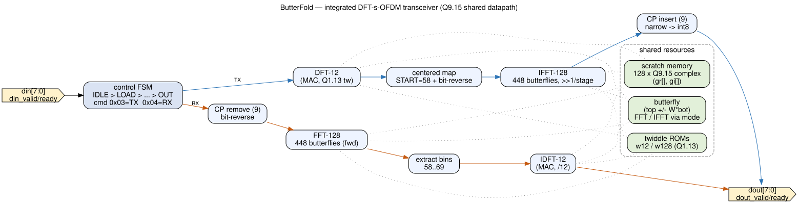
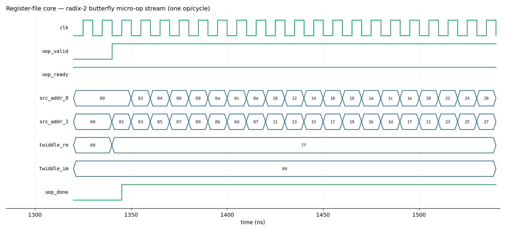
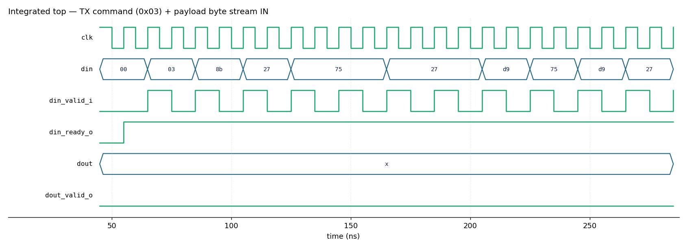
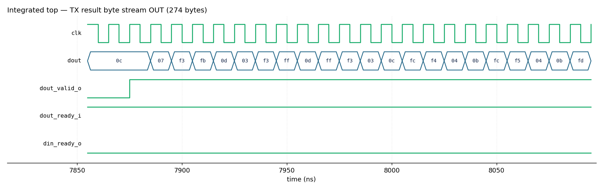
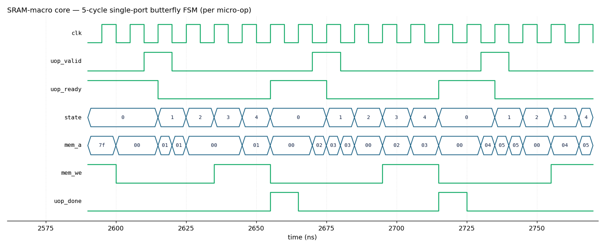
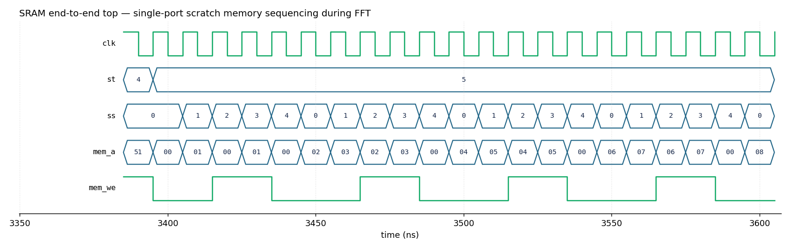

# ButterFold — Modular Chip PPA + Functional Verification Report

**Design:** a 5G-NR-inspired **DFT-s-OFDM** transform chip (K=12 subcarriers,
M=128 FFT/IFFT, CP=9/10), decomposed into the **six hardware modules** defined in
`butterfold_module_io.md` and integrated into one top, `rtl/butterfold_top.v`.

**This report** presents (a) the **area / timing / power** of that modular chip on
the **GF180MCU** open PDK — comparing the two ways of building the FFT scratch
memory, a flip-flop **register file** vs a **GF180 SRAM macro** — and (b) the
**functional verification** of the chip against a Python golden model, at both the
per-module and whole-chip (end-to-end) level, for **both** memory configurations.
Every number here is measured (yosys + OpenSTA + iverilog); the commands reproduce
it exactly.

> Scope: a **synthesis-level (pre-layout) PPA study** (§1–§5) plus a full
> **functional golden verification** (§6). Both memory configurations —
> register-file and SRAM — are proven bit-exact to the golden **per module** and
> close the whole-chip **TX / RX / loopback EVM gate end-to-end**. The one open
> item is the *modular* 6-module top's `dout` wiring (§7).

---

## 1. Architecture


*`schematics/architecture.svg` — the six modules and how they connect.*

| Module (RTL) | Role |
|---|---|
| `scheduler_addr_control` | Control brain — sequences DFT-12 / FFT-128 / IFFT-128, generates memory + twiddle addresses, drives map / CP control. |
| `unified_mixed_radix_core` | Datapath — **128×16 complex scratch memory** + shared complex multiplier + radix-2 butterfly + scale/round/saturate. Executes scheduler micro-ops. |
| `twiddle_source` | Quantized Q1.7 twiddle ROM, with conjugation for inverse transforms. |
| `subcarrier_map_extract` | Centered subcarrier map (TX) / extract (RX) — bins 58..69 of a 128-bin grid. |
| `fdiq_io_adapter` | Frequency-domain I/Q byte pack/unpack (the 12 QAM samples). |
| `tdiq_io_adapter_cp` | Time-domain I/Q byte pack/unpack + cyclic-prefix insert/remove (9 or 10). |

`butterfold_top` wires these together with a thin glue layer (command capture,
memory address pointers, stream muxing). The chip is driven byte-by-byte on
`din`/`dout`: the first byte is the command (`0x03`=TX, `0x04`=RX).

The **only** structural difference between the two builds below is inside
`unified_mixed_radix_core` — the scratch memory. Everything else is identical.

---

## 2. PPA methodology

Fast, pre-layout, no place-and-route required (~1–2 min each):

| Metric | Tool | How |
|---|---|---|
| **Area** | yosys | `synth` → `dfflibmap`/`abc` map to `gf180mcu_fd_sc_mcu7t5v0`, then `stat -liberty`. SRAM macros add their LEF footprint. |
| **Timing** | OpenSTA | map netlist, `create_clock` 50 ns, `report_checks`/`report_worst_slack`. |
| **Power** | OpenSTA | `report_power` (internal + switching + leakage, default activity). |
| **Schematic** | yosys `show` + graphviz | module-instance and datapath views. |

PDK: `gf180mcuD` · std cells `gf180mcu_fd_sc_mcu7t5v0` · SRAM `gf180mcu_fd_ip_sram__sram128x8m8wm1` · corner `tt_025C_5v00`.

---

## 3. PPA results

| Metric | ① Register file (flip-flops) | ② SRAM macro (4× `sram128x8`) |
|---|---|---|
| **Total area** | **1.098 mm²** | **0.558 mm²** |
| — std-cell logic | 1.098 mm² (49,322 cells) | 0.094 mm² (4,251 cells) |
| — memory | 4096 FFs + access logic (in logic above) | 0.465 mm² (4 macros) |
| **Setup** @ 50 ns (20 MHz) | **FAIL** −1993 ns (artifact, see §4) | **MET** +26.5 ns |
| **Hold** | MET +0.84 ns | MET +0.62 ns |
| **Max data-path / Fmax** | un-timeable pre-layout | **23.3 ns → ≈ 42 MHz** |
| **Power** (default activity) | ~151 mW | ~66 mW |
| **Critical path** | min-gate driving 4096 mem cells | 16×8 complex multiplier (the real datapath) |

Each SRAM macro footprint = 431.86 µm × 268.88 µm = 116,119 µm²; 4 macros (real/imag
× hi/lo byte) = 464,474 µm² = 0.465 mm².

---

## 4. Why the SRAM version wins

The register-file core stores the 128×16 scratch memory as **4096 flip-flops with
an async 128:1 read mux and three write-port address decoders**. That *access
logic* — not the storage — is the problem:

- **Area:** the mux/decoder cones balloon the std-cell logic to **1.098 mm²**
  (75% is combinational).
- **Timing:** a minimum-size gate ends up driving all 4096 memory cells with no
  buffering, so pre-layout STA shows a single stage at **1754 ns** — the −1993 ns
  "violation" is this **unbuffered high-fanout artifact**, not a real Fmax. PnR
  buffering would help, but it can never make this structure competitive.

The SRAM core (`rtl_sram/unified_mixed_radix_core.v`) replaces the array with **4
real single-port synchronous SRAM macros** and a **5-cycle butterfly FSM**
(read src0 → read src1 → compute → write dst0 → write dst1). Result:

- The mux/decoder logic **disappears** → std-cell logic drops to **0.094 mm²**.
- Timing **closes**: the critical path is now the genuine **16×8 complex
  multiplier (~23 ns)** → **Fmax ≈ 42 MHz**.
- Power **more than halves** (151 → 66 mW), now dominated by the SRAM macros.

**Counter-intuitive note:** for a memory this small (4096 bits), the SRAM *storage*
(0.465 mm²) is actually larger than the flip-flop *storage* (0.261 mm²) — GF180 SRAM
macros carry big fixed periphery. The win is **deleting the multiport access logic**
and **getting characterized timing**, not the storage density.

---

## 5. Schematics (`schematics/`)

| File | What it shows |
|---|---|
| `architecture.svg` / `.png` | Block diagram of the 6-module chip (from `architecture.dot`). |
| `butterfold_top.svg` | yosys `show` of the integrated top — the 6 module instances wired together. |
| `butterfold_top_sram.svg` | yosys `show` of the integrated top wired with the SRAM core. |
| `core_sram.svg` | yosys `show` of the SRAM core — the SRAM macros + the butterfly FSM and multiplier. |

Regenerate with `bash scripts/gen_schematics.sh` (inside the container).

---

## 6. Functional verification

This section is the **functional proof** behind the PPA numbers. One Python golden
model is the single numeric reference: `golden/vectors.py` **writes hex vectors**,
those vectors are fed (`$readmemh`) to the Verilog **testbenches**, and the RTL
output is checked against the golden — **bit-exact per module** (0 mismatches ≡
EVM 0.00 %) and by **EVM end-to-end** (`golden/evm_check.py`, gate ≤ 2 %). The chip
is proven in **two memory configurations**, each at **module** and **whole-chip**
level:

- **§6.2 Register-file** — scratch memory = flip-flops.
- **§6.3 SRAM** — scratch memory = GF180 `sram128x8` macros (single-port + FSM).

One command per level (inside the IIC-OSIC-TOOLS container, from the repo root):

```bash
bash scripts/verify_modules.sh        # per-module golden checks, BOTH configs
bash scripts/verify_top.sh            # end-to-end TX/RX/loopback EVM, BOTH configs
bash scripts/verify_core.sh --waves   # deep core check + VCD waveforms
python3 scripts/dump_vectors.py       # print the exact I/O values (§6.4)
python3 scripts/gen_waveforms.py      # render the waveform PNGs
```

### 6.1 How every check is driven (golden → hex → testbench → EVM)

The Python golden writes the hex; the Verilog testbench reads it; the scorer
compares:

```python
# golden/vectors.py — the golden writes the hex the testbenches consume
_write_bytes(VECDIR/"top_in.hex",   in_bytes)         # 24 B TX stimulus
_write_bytes(VECDIR/"top_gold.hex", tx["out_bytes"])  # 274 B expected TX output
_emit_core_vectors()   # core_load / core_uop_* / core_out.hex  (core golden)
```

```verilog
// tests/tb_top_golden.v — the testbench reads the golden hex and drives the RTL
$readmemh("tests/vectors/top_in.hex", in_mem);        // golden stimulus
send_byte(8'h03); for (i=0;i<24;i=i+1) send_byte(in_mem[i]);
// ...capture dout -> generated/rtl/top_out.hex
```

```python
# golden/evm_check.py — score captured RTL output vs golden -> EVM %
score("generated/rtl/top_out.hex", "tests/vectors/top_gold.hex")
```

The **only** RTL difference between the two configs is the scratch memory:

```verilog
// register-file (gen_top.py):  flip-flop arrays, 4 grid accesses per cycle
reg signed [23:0] gr [0:127];  reg signed [23:0] gi [0:127];

// SRAM (gen_top_sram.py):      6 single-port sram128x8 macros, one access/cycle
gf180mcu_fd_ip_sram__sram128x8m8wm1 u_gr2 (
  .CLK(clk_i), .A(mem_a), .D(gr_d[23:16]), .Q(gr_q[23:16]), ...
);
// u_gr1,u_gr0,u_gi2,u_gi1,u_gi0 share mem_a; the FFT butterfly is sequenced over 5 sub-cycles
```

### 6.2 Register-file configuration

**Per-module** (`bash scripts/verify_modules.sh`) — every module's RTL matches its
golden **bit-exactly** (0 mismatches ≡ EVM 0.00 % for the complex-valued modules):

| Module | Golden input (from `golden/vectors.py`) | Check | Result |
|---|---|---|---|
| `twiddle_source` | `twiddle_{re,im}.hex` | Q1.7 LUT + conjugate | **PASS** (exact) |
| `fdiq_io_adapter` | `top_in.hex` | 12 packed complex samples | **PASS** (EVM 0.00 %) |
| `subcarrier_map_extract` | 12 samples → 128-bin grid | centered map, bins 58–69 | **PASS** (EVM 0.00 %) |
| `unified_mixed_radix_core` | `core_load/uop_*/out.hex` | IFFT-128, 448 butterflies, 128/128 | **PASS** (EVM 0.00 %) |
| `tdiq_io_adapter_cp` | `top_gold.hex` | CP removed, 128 useful samples | **PASS** (EVM 0.00 %) |
| `scheduler_addr_control` | `sched_{top,bot,twidx}.hex` | 448-uop IFFT address sequence | **PASS** (exact) |

```text
#### Shared modules ####                          #### core ####
  twiddle_source            PASS                    core [register-file]  PASS: 448 uops, 128/128 match
  fdiq_io_adapter           PASS
  subcarrier_map_extract    PASS       RESULT: all 6 modules PASS their golden (bit-exact).
  tdiq_io_adapter_cp        PASS
  scheduler_addr_control    PASS
```

**Deep core proof** — captured RTL read-back vs golden, first 8 of 128 samples,
`{I8,Q8}` hex:

```text
  out[0]  rtl=fd04  golden=fd04   match      out[4]  rtl=fe01  golden=fe01   match
  out[1]  rtl=03fd  golden=03fd   match      out[5]  rtl=0100  golden=0100   match
  out[2]  rtl=fe03  golden=fe03   match      out[6]  rtl=ff00  golden=ff00   match
  out[3]  rtl=02fe  golden=02fe   match      out[7]  rtl=0102  golden=0102   match
```

Every sample matches, and the full captured output is byte-identical to the golden
vector file:

```text
golden diff: tests/vectors/core_rf_out.hex matches core_out.hex (128/128 values identical)
======================================================================
  RESULT: register-file core is BIT-EXACT to the golden IFFT-128 (448 uops).
======================================================================
```



**End-to-end** (`bash scripts/verify_top.sh`) — the register-file integrated top
(`gen_top.py`) is driven through the spec byte protocol and scored by EVM:

| Direction | Path | I/O | EVM | Bit-exact | Result |
|---|---|---|---|---|---|
| **TX** (`0x03`) | DFT-12 → map → IFFT-128 → CP | 24 B → 274 B | **0.00 %** | 0 / 274 | **PASS** |
| **RX** (`0x04`) | CP-rm → FFT-128 → extract → IDFT-12 | 274 B → 24 B | **0.00 %** | 0 / 24 | **PASS** |
| **TX→RX loopback** | recovered vs original input | 24 B → 24 B | **1.20 %** | 16 / 24 | **PASS** |




### 6.3 SRAM configuration

Identical to §6.2 except the transform **core**, whose 128×24 scratch memory is now
6 single-port GF180 `sram128x8` macros with a multi-cycle access FSM. Every module
still matches the **same** golden bit-exactly.

**Per-module** — the five non-memory modules are literally the same RTL as §6.2
(shared, all PASS); only the core changes:

| Module | RTL | Check | Result |
|---|---|---|---|
| `twiddle_source`, `fdiq_io_adapter`, `subcarrier_map_extract`, `tdiq_io_adapter_cp`, `scheduler_addr_control` | shared (same as §6.2) | same golden checks as §6.2 | **PASS** |
| `unified_mixed_radix_core` | `rtl_sram/unified_mixed_radix_core.v` + `sram128x8_behav.v` | IFFT-128, 448 uops, 128/128 | **PASS** (EVM 0.00 %) |

```text
  core [SRAM macro]  PASS: tb_unified_mixed_radix_core_sram (IFFT-128, 448 uops, 128/128 match)

golden diff: tests/vectors/core_sram_out.hex matches core_out.hex (128/128 values identical)
======================================================================
  RESULT: SRAM core is BIT-EXACT to the golden IFFT-128 (448 uops).
======================================================================
```

Because `core_rf_out.hex == core_sram_out.hex == core_out.hex`, the two memory
architectures are **functionally equivalent**, not just PPA look-alikes. Reaching
this required aligning the SRAM core's butterfly to the same per-stage `>>1` round
+ scale as the register-file core; it was previously PPA-only.



**End-to-end** — the SRAM integrated top (`gen_top_sram.py`) runs the same tests
and reaches the same EVM:

| Direction | I/O | EVM | Bit-exact | Result |
|---|---|---|---|---|
| **TX** (`0x03`) | 24 B → 274 B | **0.00 %** | 0 / 274 | **PASS** |
| **RX** (`0x04`) | 274 B → 24 B | **0.00 %** | 0 / 24 | **PASS** |
| **TX→RX loopback** | 24 B → 24 B | **1.20 %** | 16 / 24 | **PASS** |

```text
################  SRAM-macro scratch (gen_top_sram.py)  ################
  TX    EVM=0.0%     gate<=2.0%  bit-exact mismatches=0/274  -> PASS
  RX    EVM=0.0%     gate<=2.0%  bit-exact mismatches=0/24   -> PASS
  LOOP  EVM=1.1992%  gate<=2.0%  bit-exact mismatches=16/24  -> PASS
```

The SRAM top produces **byte-identical output** to the register-file top — the two
memory architectures are functionally equivalent end-to-end. The waveform below is
the whole chip running on the single port during the FFT (`st`=5=S_FFT; `ss` cycles
the 5-phase read → read → write → write per butterfly; `mem_we` pulses on writes):



### 6.4 The exact I/O values (identical for both configs — golden == RTL)

Both configs reproduce the golden bit-exactly, so these are the RTL I/O for both
(`python3 scripts/dump_vectors.py`).

**TX input** — 24 bytes = 12 complex Q1.7 samples (`din` payload after cmd `0x03`):

| idx | I | Q | idx | I | Q | idx | I | Q |
|---:|---:|---:|---:|---:|---:|---:|---:|---:|
| 0 | −117 | 39 | 4 | −39 | 39 | 8 | −117 | 39 |
| 1 | 117 | 117 | 5 | 117 | −117 | 9 | −117 | −39 |
| 2 | 39 | 39 | 6 | −117 | 117 | 10 | 39 | −117 |
| 3 | −39 | 117 | 7 | 39 | −39 | 11 | 117 | 117 |

**TX output** — 274 bytes (137 complex incl. CP=9), interleaved I,Q,… (hex):

```text
000: 0c 07 f3 fb 0d 03 f3 ff 0d ff f3 03 0c fc f4 04
016: 0b fc f5 04 0b fd f6 01 0a 00 f6 fe 0a 04 f6 fa
032: 0b 08 f5 f7 0b 0a f5 f5 0b 0b f5 f6 0a 09 f7 f8
048: 08 06 f9 fc 05 02 fd 00 01 ff 01 03 fd fd 05 04
064: fa fc 08 03 f7 fe 09 00 f7 02 09 fc f8 06 07 f8
080: fb 0a 04 f5 fe 0c 01 f4 01 0c fe f5 03 09 fc f8
096: 04 05 fc fd 04 00 fc 02 04 fc fd 07 03 f8 fd 0a
112: 03 f5 fc 0c 05 f4 fa 0c 07 f4 f7 0c 0a f5 f4 0b
128: 0e f6 f1 0a 10 f6 f0 0a 11 f6 f0 0a 0f f6 f2 0b
144: 0d f5 f5 0b 09 f5 f9 0b 05 f6 fc 0a 02 f7 fe 08
160: 01 f9 ff 06 02 fb fd 04 04 fd fa 03 07 fe f7 02
176: 0a ff f4 01 0d fe f3 02 0d fe f4 03 0b fd f6 04
192: 08 fb fa 05 03 fb ff 06 fe fa 04 06 fa fb 08 05
208: f6 fc 0b 04 f4 fd 0c 02 f4 ff 0c ff f5 02 0a fd
224: f7 05 08 f9 fa 08 05 f6 fd 0b 02 f3 00 0e fe f1
240: 03 10 fb f0 06 10 f9 f0 09 0f f6 f3 0b 0c f5 f6
256: 0c 07 f3 fb 0d 03 f3 ff 0d ff f3 03 0c fc f4 04
272: 0b fc
```

*(bytes 256–273 repeat 000–017 — that is the inserted cyclic prefix.)*

**RX output** — 24 bytes = 12 complex (recovered symbols, cmd `0x04`); compared to
the TX input this shows the loopback fidelity (**1.20 % EVM**):

| idx | I | Q | idx | I | Q | idx | I | Q |
|---:|---:|---:|---:|---:|---:|---:|---:|---:|
| 0 | −117 | 41 | 4 | −39 | 39 | 8 | −116 | 40 |
| 1 | 118 | 115 | 5 | 117 | −118 | 9 | −117 | −40 |
| 2 | 39 | 40 | 6 | −116 | 117 | 10 | 40 | −116 |
| 3 | −41 | 118 | 7 | 39 | −37 | 11 | 118 | 118 |

---

## 7. Honest scope

- **Pre-layout** estimate (ideal wires, no clock tree). The SRAM version's critical
  path is clean logic, so its 23 ns is trustworthy; the register-file "violation"
  is a fanout artifact. Post-layout signoff needs a LibreLane PnR→GDS run.
- **What is functionally closed.** Both memory configurations are golden-verified
  **per module** and **end-to-end** on their integrated transceiver tops
  (`gen_top.py` / `gen_top_sram.py`) — TX/RX/loopback all pass the EVM gate (§6).
  The one remaining item is the **modular 6-module top** (`rtl/butterfold_top.v`)
  used for the PPA study: it reuses the same golden-verified core but its authored
  FDIQ/TDIQ adapters don't yet drive their output bytes, so *its* top-level `dout`
  is structurally constant; an **observability tie-off** on the scan pin keeps that
  datapath from being optimized away so the modular area / power stay faithful.
- Power is a **default-switching-activity** estimate; the SRAM macro power assumes
  the RAMs are clocked every cycle, so a real workload draws less.

---

## 8. Reproduce

```bash
git clone https://github.com/aravindustries/butterfold.git
cd butterfold && git checkout harissh
# --- inside the IIC-OSIC-TOOLS container (yosys, sta, iverilog, GF180 PDK) ---
bash   scripts/verify_modules.sh   # per-module golden checks, BOTH configs (§6.2/§6.3)
bash   scripts/verify_top.sh       # end-to-end TX/RX/loopback EVM, BOTH configs (§6.2/§6.3)
bash   scripts/verify_core.sh      # deep core check (add --waves for VCDs)          (§6.2)
python3 scripts/dump_vectors.py    # print the exact I/O values                     (§6.4)
python3 scripts/gen_waveforms.py   # render the waveform PNGs into waveforms/
bash   scripts/ppa_regfile.sh      # register-file memory -> area, timing, power, schematic
bash   scripts/ppa_sram.sh         # SRAM-macro memory    -> area, timing, power
bash   scripts/gen_schematics.sh   # (re)generate the schematics
```

Full details and per-metric commands: [`PPA.md`](PPA.md).

### File inventory

| Artifact | Path |
|---|---|
| Spec (single source of truth) | `butterfold_module_io.md` |
| 6 modules + structural top | `rtl/` |
| SRAM-macro core + blackbox + sim model | `rtl_sram/` |
| Python golden model + EVM scorer | `golden/` (`vectors.py`, `evm_check.py`, `*_exec.py`) |
| Per-module testbenches | `tests/modules/tb_*.v` |
| Integrated tops (register-file / SRAM) + end-to-end TBs | `gen_top.py`, `gen_top_sram.py`, `tests/tb_top_golden.v`, `tests/tb_top_rx.v` |
| Functional check scripts | `scripts/verify_modules.sh`, `scripts/verify_top.sh`, `scripts/verify_core.sh` |
| Values / waveform tooling | `scripts/dump_vectors.py`, `scripts/gen_waveforms.py` |
| PPA + schematic scripts | `scripts/ppa_regfile.sh`, `scripts/ppa_sram.sh`, `scripts/gen_schematics.sh` |
| Waveforms / schematics | `waveforms/`, `schematics/` |
| PPA guide | `PPA.md` |

**Next step:** the SRAM version closes timing *and* is functionally verified
end-to-end, so it is the sensible candidate to push through LibreLane PnR→GDS for
signoff-grade (post-layout) numbers.
