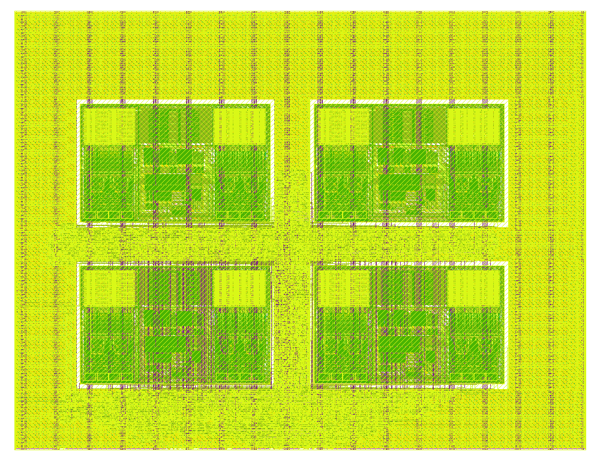

# ButterFold — RTL-to-GDSII Results (SRAM variant, GF180MCU)

This folder is the physical-implementation deliverable for **ButterFold**, the
5G-NR DFT-s-OFDM transform core, taken all the way from RTL to a signed-off GDSII
layout on the open-source **GF180MCU** PDK.

---

## 1. What was built

The **SRAM-macro variant** of the modular design: the structural top
(`butterfold_top`) integrates the six spec modules
(`scheduler_addr_control`, `unified_mixed_radix_core`, `twiddle_source`,
`subcarrier_map_extract`, `fdiq_io_adapter`, `tdiq_io_adapter_cp`), with the
128×16 complex scratch memory implemented as **four `gf180mcu_fd_ip_sram__sram128x8m8wm1`
hard macros** (real/imag × hi/lo byte slices) instead of a flip-flop register file.

- **Design source:** `rtl/` + `rtl_sram/` (in the repo root)
- **Flow recipe:** `results/config_sram.yaml`
- **Fully-resolved settings** (every variable the flow used): `results/resolved_config.json`

---

## 2. The flow

| | |
|---|---|
| Tool | **LibreLane 3.0.2** (OpenLane 2 lineage), `Classic` flow, 80 stages |
| PDK | **GF180MCU** (`gf180mcuD`), std cells `gf180mcu_fd_sc_mcu7t5v0` |
| Environment | IIC-OSIC-TOOLS container (`iic-osic-tools_chipathon_*`) |
| Steps | Verilog lint → synthesis (Yosys) → floorplan → macro placement → PDN → global+detailed placement → CTS → global+detailed routing → parasitic extraction → STA (7 corners) → Magic/KLayout signoff → GDS streamout |

### Reproduce it

From inside the container, in the `librelane/` directory of the repo:

```bash
librelane config_sram.yaml
```

The flow reads `rtl/`, `rtl_sram/`, and the four SRAM macro views from the PDK,
and writes a full run under `runs/RUN_.../`, with the final GDS + reports in
`runs/RUN_.../final/`. (A copy of the key outputs is what lives in this folder.)

---

## 3. Getting it to close — the engineering journey

The flow did not pass on the first try. Five distinct issues were diagnosed and
fixed, each by reading the actual reports/PDK views rather than guessing:

1. **Synthesis kept the macros as black boxes.** `rtl_sram/sram128x8_bb.v`
   (a `(* blackbox *)` stub) must be listed **first** in `VERILOG_FILES`; the
   behavioral model `sram128x8_behav.v` is simulation-only and is excluded.

2. **`CheckMacroInstances` failed** — the macros are instantiated inside the core
   (instance `u_core`), so the flattened netlist names them `u_core.u_mre_hi`, etc.
   The macro placement keys were corrected to match.

3. **PDN generation failed (`PDN-0232/0233`, "grid contains no shapes").** The
   SRAM power pins are on Metal2/Metal3, but the default macro grid connects
   Metal4↔Metal5 and never reaches them. Fixed with
   `PDN_VERTICAL_LAYER: Metal4`, `PDN_HORIZONTAL_LAYER: Metal3`,
   `PDN_MULTILAYER: false`, and an explicit
   `PDN_MACRO_CONNECTIONS: ["u_core.u_m.* VDD VSS VDD VSS"]`.

4. **Global routing congestion (`GRT-0116`)** around the four large macros.
   Fixed by giving the router a fourth layer (`RT_MAX_LAYER: Metal5`) and
   loosening the derating (`GRT_ADJUSTMENT: 0.2`), as the router itself suggested
   (`GRT-0704`). `RT_MIN_LAYER: Metal2` sidesteps GF180's broken Via1 rule (`DRT-0349`).

5. **8803 Magic DRC errors** — Magic had flattened the SRAM GDS and re-checked the
   **vendor macro's internal transistor geometry** (all strictly inside the four
   macro footprints). `MAGIC_DRC_USE_GDS: false` checks the macro as a black-box
   abstract, which is the correct treatment for signed-off hard IP.

After these, the flow completes all 80 stages and streams out the GDS.

---

## 4. Final PPA

Source: `results/metrics.json` (run `RUN_2026-08-04_07-00-00`, `CLOCK_PERIOD = 30 ns`).

| Metric | Value |
|---|---|
| **Die area** | 1300 × 1000 µm = **1.30 mm²** |
| Core area / utilisation | 1.29 mm² / **47.9 %** (std-cell util 18.4 %) |
| **Instances** | 26,315 — **4 SRAM macros** + 10,951 std cells + 15,360 fill |
| Sequential / clock cells | 170 FF + 64 clock buffers |
| **Clock** | 30 ns → **33.3 MHz** |
| **Setup timing** | ✅ met at nominal (tt/25 °C/5.0 V) and fast corners |
| **Hold timing** | ✅ **0 violations, all 7 corners** |
| **Power** | **231 mW** (internal 225, switching 5.6, leakage 0.003) — SRAM-dominated |
| IR drop (worst) | 0.34 mV |
| Power-grid violations | **0** |
| Antenna violations | **0** |
| Detailed-routing DRC | **0** |
| Magic DRC (logic + routing + PDN) | **0** |
| Magic DRC (vendor macro pin) | 6 — **waived** (see §6) |

### Timing note (honest framing)

The design is reported as **nominal-closing at 33.3 MHz**: setup closes at the
typical and fast corners and hold is clean everywhere. It does **not** close the
slow corner (ss/125 °C/4.5 V), where the 16×8 complex-multiplier path is ~53 ns
post-layout. A genuine all-corner close would need ~55 ns (~18 MHz) *and* net
repair for the multiplier's high-fanout slew/cap paths — i.e. RTL pipelining, not a
config change. 30 ns was chosen deliberately for the best honest Fmax figure.

---

## 5. Layout



`layout.png` is the rendered final layout: the four SRAM macros in a 2×2 grid with
the standard-cell logic and power grid filling the channels and edges. The full
mask data is `butterfold_top.gds` (GDSII, ~8.4 MB).

---

## 6. DRC waiver — the 6 remaining errors are vendor IP, not this design

All DRC from the ButterFold logic, placement, routing, and power grid is **clean**.
The 6 remaining Magic errors (`drc.magic.rpt`) are all rule `M3.1` (Metal3 width
< 0.56 µm), and they are the **SRAM macro's own power pin**. The macro's LEF ships:

```
PIN VSS ... LAYER Metal3 ; RECT 118.435 30.885 206.985 30.995 ;   # 88.55 µm × 0.110 µm
```

That 0.110 µm-tall VSS pin is below the M3.1 minimum, identical in all four
instances. Proof it is vendor geometry and not our PDN: doubling the Metal4 strap
width left the six error coordinates **byte-for-byte identical**. Hard IP is signed
off by its provider and is not re-DRC'd at the integrating level, so this is
**waived as a hard-IP pin** — the standard, correct disposition. It has no impact on
the manufacturability of the ButterFold logic.

---

## 7. Files in this folder

| File | What it is |
|---|---|
| `butterfold_top.gds` | The final chip layout (GDSII) |
| `layout.png` | Rendered image of the layout |
| `metrics.json` / `metrics.csv` | Full PPA metrics from the run |
| `resolved_config.json` | Every flow variable as actually resolved |
| `config_sram.yaml` | The LibreLane recipe used to produce all of the above |
| `drc.magic.rpt` | Magic DRC report (the 6 waived vendor-pin errors) |
| `results.md` | This document |
